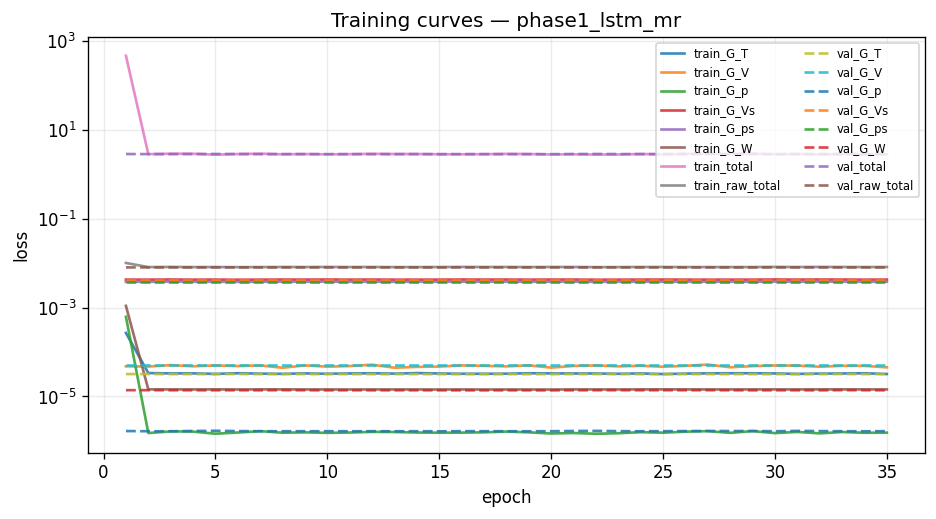
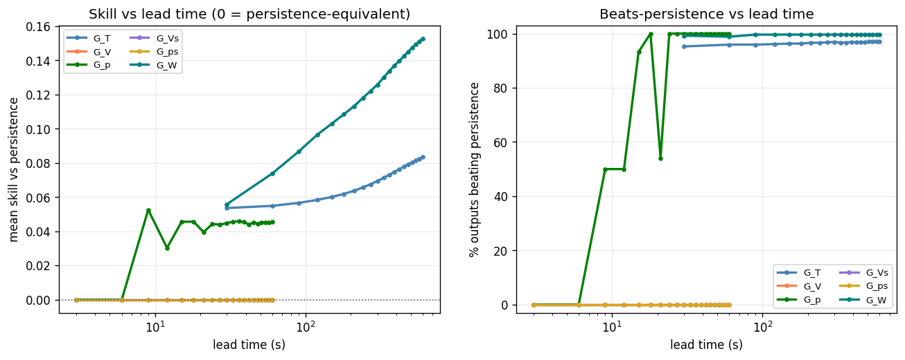
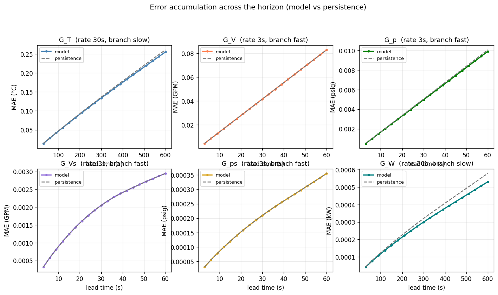
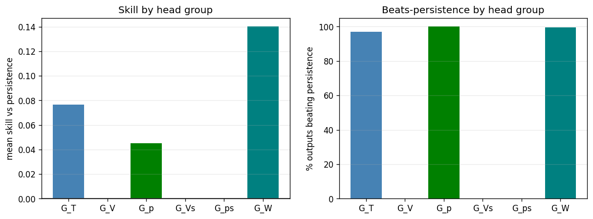

# Phase 1 (lstm) — `phase1_lstm_mr`

*Generated 2026-08-02 11:08:56 · MultiRateLSTM · 20,785,886 parameters · 67.6 min*

## Run notes

Phase 1 baseline LSTM trained MULTI-RATE on the 720 h `systematic-720` data, on exactly the task run19b (MR-MIONet) was scored on: hydraulics at 3 s with 300 s look-back, thermal/power at 30 s with 1200 s look-back, uniform K=20 horizons (600 s thermal/power, 60 s hydraulic), seeded 80/10/10 chunk split.

Why it exists: until the library gained multi-rate support for phases 1-6, the baselines were trained on a DIFFERENT (single-rate) task than MR-MIONet, so every previous cross-phase comparison was apples to oranges. This run and its siblings put all seven models on one task so the comparison table is honest.

Architecture: per-branch LSTM + temporal attention -> concatenated context -> direct per-head MLP. Deliberately NO operator basis and NO Fourier trunk; phase 1 is the floor those features must beat.

Read the result by mean SKILL vs persistence, not mean R². G_Vs (V_flow_sec) is a measured channel noise floor — the signal-floor diagnostic showed its deltas are temporally white — so a low R² there is expected for every phase and is not a phase-1 failure.

## Headline

| metric | value |
| --- | --- |
| Outputs | 2827 |
| Mean R² | 0.9256 |
| Median R² | 0.9994 |
| Min R² | 0.0896 |
| Beats persistence | 62.5% |
| **Mean skill score** | **+0.0488** |

> Skill vs persistence is the headline metric, not mean R². Several channels sit at their noise floor, where R² is low for *any* predictor including persistence.

## Task (identical across phases 1-6 and run19b)

| group | rate (s) | history | K | window (s) | horizon (s) | branch |
| --- | --- | --- | --- | --- | --- | --- |
| G_T | 30 | 40 | 20 | 1200 | 600 | slow |
| G_V | 3 | 100 | 20 | 300 | 60 | fast |
| G_p | 3 | 100 | 20 | 300 | 60 | fast |
| G_Vs | 3 | 100 | 20 | 300 | 60 | fast |
| G_ps | 3 | 100 | 20 | 300 | 60 | fast |
| G_W | 30 | 40 | 20 | 1200 | 600 | slow |

| split | chunks | windows |
| --- | --- | --- |
| train | [0, 1, 2, 3, 4, 5, 7, 9, 10, 15, 16, 17, 18, 20, 21, 23, 24, 25, 26, 27, 28, 29, 30, 31, 32, 33, 34, 37, 38, 39, 40, 42, 43, 44, 45, 46, 48, 50, 51, 52, 55, 56, 57, 58, 59, 60, 61, 62, 63, 67, 68, 69, 70, 71, 72, 73, 74, 75, 76, 78, 79, 80, 81, 82, 83, 84, 85, 86, 87, 88, 89, 90, 91, 92, 93, 94, 95, 96, 98, 99, 100, 101, 103, 104, 105, 106, 108, 110, 111, 112, 115, 117, 118, 119, 120, 121, 122, 123, 124, 125, 126, 127] | 62,934 |
| val | [6, 11, 19, 22, 35, 41, 47, 49, 54, 64, 102, 114, 116] | 8,021 |
| test | [8, 12, 13, 14, 36, 53, 65, 66, 77, 97, 107, 109, 113] | 8,021 |

## Per head group

| group | outputs | horizon (s) | mean R² | median R² | beats | mean skill |
| --- | --- | --- | --- | --- | --- | --- |
| G_T | 1028 | 600 | 0.9972 | 0.9988 | 997/1028 (97%) | +0.0766 |
| G_V | 257 | 60 | 0.9997 | 0.9997 | 0/257 (0%) | +0.0000 |
| G_p | 514 | 60 | 1.0000 | 1.0000 | 514/514 (100%) | +0.0452 |
| G_Vs | 257 | 60 | 0.3059 | 0.3060 | 0/257 (0%) | +0.0000 |
| G_ps | 514 | 60 | 0.9440 | 0.9447 | 0/514 (0%) | +0.0000 |
| G_W | 257 | 600 | 0.9995 | 0.9995 | 256/257 (100%) | +0.1401 |

## Per output type

| Output_Type | R² mean | R² min | RMSE mean | MAE mean | Beats_Persistence mean |
| --- | --- | --- | --- | --- | --- |
| T_prim_r | 0.9978 | 0.9968 | 0.2013 | 0.1321 | 0.8949 |
| T_prim_s | 0.9921 | 0.9895 | 0.4334 | 0.2843 | 1.0000 |
| T_sec_r | 0.9994 | 0.9990 | 0.1028 | 0.0747 | 0.9961 |
| T_sec_s | 0.9996 | 0.9993 | 0.0856 | 0.0609 | 0.9883 |
| V_flow_prim | 0.9997 | 0.9995 | 0.1506 | 0.0436 | 0.0000 |
| V_flow_sec | 0.3059 | 0.0896 | 0.0045 | 0.0019 | 0.0000 |
| W_flow | 0.9995 | 0.9992 | 0.0004 | 0.0003 | 0.9961 |
| p_prim_r | 1.0000 | 1.0000 | 0.0106 | 0.0061 | 1.0000 |
| p_prim_s | 1.0000 | 1.0000 | 0.0062 | 0.0043 | 1.0000 |
| p_sec_r | 0.9440 | 0.9060 | 0.0005 | 0.0002 | 0.0000 |
| p_sec_s | 0.9440 | 0.9060 | 0.0005 | 0.0002 | 0.0000 |

## 20 worst outputs by R²

| Output | Group | R² | Skill_Score | RMSE |
| --- | --- | --- | --- | --- |
| simulator[1].datacenter[1].computeBlock[140].cdu[1].summary.V_flow_sec_GPM | G_Vs | 0.0896 | 0.0000 | 0.0058 |
| simulator[1].datacenter[1].computeBlock[81].cdu[1].summary.V_flow_sec_GPM | G_Vs | 0.1279 | 0.0000 | 0.0054 |
| simulator[1].datacenter[1].computeBlock[114].cdu[1].summary.V_flow_sec_GPM | G_Vs | 0.1805 | 0.0000 | 0.0054 |
| simulator[1].datacenter[1].computeBlock[120].cdu[1].summary.V_flow_sec_GPM | G_Vs | 0.1846 | 0.0000 | 0.0055 |
| simulator[1].datacenter[1].computeBlock[207].cdu[1].summary.V_flow_sec_GPM | G_Vs | 0.2073 | 0.0000 | 0.0050 |
| simulator[1].datacenter[1].computeBlock[98].cdu[1].summary.V_flow_sec_GPM | G_Vs | 0.2077 | 0.0000 | 0.0047 |
| simulator[1].datacenter[1].computeBlock[2].cdu[1].summary.V_flow_sec_GPM | G_Vs | 0.2127 | 0.0000 | 0.0049 |
| simulator[1].datacenter[1].computeBlock[238].cdu[1].summary.V_flow_sec_GPM | G_Vs | 0.2144 | 0.0000 | 0.0048 |
| simulator[1].datacenter[1].computeBlock[162].cdu[1].summary.V_flow_sec_GPM | G_Vs | 0.2153 | 0.0000 | 0.0044 |
| simulator[1].datacenter[1].computeBlock[54].cdu[1].summary.V_flow_sec_GPM | G_Vs | 0.2180 | 0.0000 | 0.0051 |
| simulator[1].datacenter[1].computeBlock[164].cdu[1].summary.V_flow_sec_GPM | G_Vs | 0.2233 | 0.0000 | 0.0049 |
| simulator[1].datacenter[1].computeBlock[223].cdu[1].summary.V_flow_sec_GPM | G_Vs | 0.2241 | 0.0000 | 0.0047 |
| simulator[1].datacenter[1].computeBlock[156].cdu[1].summary.V_flow_sec_GPM | G_Vs | 0.2257 | 0.0000 | 0.0046 |
| simulator[1].datacenter[1].computeBlock[75].cdu[1].summary.V_flow_sec_GPM | G_Vs | 0.2267 | 0.0000 | 0.0046 |
| simulator[1].datacenter[1].computeBlock[174].cdu[1].summary.V_flow_sec_GPM | G_Vs | 0.2270 | 0.0000 | 0.0049 |
| simulator[1].datacenter[1].computeBlock[161].cdu[1].summary.V_flow_sec_GPM | G_Vs | 0.2281 | 0.0000 | 0.0047 |
| simulator[1].datacenter[1].computeBlock[48].cdu[1].summary.V_flow_sec_GPM | G_Vs | 0.2316 | 0.0000 | 0.0051 |
| simulator[1].datacenter[1].computeBlock[1].cdu[1].summary.V_flow_sec_GPM | G_Vs | 0.2365 | 0.0000 | 0.0047 |
| simulator[1].datacenter[1].computeBlock[25].cdu[1].summary.V_flow_sec_GPM | G_Vs | 0.2372 | 0.0000 | 0.0044 |
| simulator[1].datacenter[1].computeBlock[101].cdu[1].summary.V_flow_sec_GPM | G_Vs | 0.2385 | 0.0000 | 0.0051 |

## Figures

### Training and validation loss per epoch.



### Skill and beats-persistence fraction versus lead time.



### Mean absolute error across the horizon, model versus persistence, per head.



### Per-head-group skill and beats-persistence.



## Full console log

```text
[ddp] rank 0/8 local_rank 0 device cuda:0  visible=8
==========================================================================
PHASE 1 — lstm   [phase1_lstm_mr]
==========================================================================
device: cuda:0
multi_rate: True   store rates (s): [3, 30]
group   rate(s)  history    K  window(s)  horizon(s)  branch
G_T          30       40   20       1200         600  slow
G_V           3      100   20        300          60  fast
G_p           3      100   20        300          60  fast
G_Vs          3      100   20        300          60  fast
G_ps          3      100   20        300          60  fast
G_W          30       40   20       1200         600  slow

============================================================
COLUMN IDENTIFICATION (Federated)
============================================================
Input columns:              515
Total dynamic outputs:      2827
  G_T  (temperatures):      1028
  G_V  (prim flow):         257
  G_p  (prim pressure):     514
  G_Vs (sec flow):          257
  G_ps (sec pressure):      514
  G_W  (pump power):        257
  Per-type index maps:      11 types

inputs: 515   dynamic outputs: 2827
[store] present, reusing: /lustre/orion/scratch/yishak_tadele/gen053/summit/data/systematic-720/store
[norm] loading shared normalizer: /lustre/orion/scratch/yishak_tadele/gen053/summit/data/systematic-720/store/normalizer_shared.json
FederatedNormalizer loaded from /lustre/orion/scratch/yishak_tadele/gen053/summit/data/systematic-720/store/normalizer_shared.json
loader workers: 6   batch: 32
Federated store [chunk split]: train=[0, 1, 2, 3, 4, 5, 7, 9, 10, 15, 16, 17, 18, 20, 21, 23, 24, 25, 26, 27, 28, 29, 30, 31, 32, 33, 34, 37, 38, 39, 40, 42, 43, 44, 45, 46, 48, 50, 51, 52, 55, 56, 57, 58, 59, 60, 61, 62, 63, 67, 68, 69, 70, 71, 72, 73, 74, 75, 76, 78, 79, 80, 81, 82, 83, 84, 85, 86, 87, 88, 89, 90, 91, 92, 93, 94, 95, 96, 98, 99, 100, 101, 103, 104, 105, 106, 108, 110, 111, 112, 115, 117, 118, 119, 120, 121, 122, 123, 124, 125, 126, 127] val=[6, 11, 19, 22, 35, 41, 47, 49, 54, 64, 102, 114, 116] test=[8, 12, 13, 14, 36, 53, 65, 66, 77, 97, 107, 109, 113] | multi_rate=True rates=[3, 30]
  windows: train=62934 val=8021 test=8021
[ddp] train sharded: 62934 windows / 8 ranks = ~7866 each; 245 steps/rank/epoch
DATA MANIFEST: {'train_chunks': [0, 1, 2, 3, 4, 5, 7, 9, 10, 15, 16, 17, 18, 20, 21, 23, 24, 25, 26, 27, 28, 29, 30, 31, 32, 33, 34, 37, 38, 39, 40, 42, 43, 44, 45, 46, 48, 50, 51, 52, 55, 56, 57, 58, 59, 60, 61, 62, 63, 67, 68, 69, 70, 71, 72, 73, 74, 75, 76, 78, 79, 80, 81, 82, 83, 84, 85, 86, 87, 88, 89, 90, 91, 92, 93, 94, 95, 96, 98, 99, 100, 101, 103, 104, 105, 106, 108, 110, 111, 112, 115, 117, 118, 119, 120, 121, 122, 123, 124, 125, 126, 127], 'val_chunks': [6, 11, 19, 22, 35, 41, 47, 49, 54, 64, 102, 114, 116], 'test_chunks': [8, 12, 13, 14, 36, 53, 65, 66, 77, 97, 107, 109, 113], 'windows': {'train': 62934, 'val': 8021, 'test': 8021}}

model: MultiRateLSTM   parameters: 20,785,886

--------------------------------------------------------------------------
TRAINING
--------------------------------------------------------------------------
Distributed training: rank 0/8

======================================================================
PER-HEAD LOSS NORMALISATION (persistence baseline)
======================================================================
  head       baseline    cfg_w    effective
  G_T    3.384053e-05     1.00   2.9550e+04
  G_V    4.815543e-05     0.00   0.0000e+00
  G_p    1.583450e-06     1.00   6.3153e+05
  G_Vs   4.255081e-03     0.00   0.0000e+00
  G_ps   3.809307e-03     0.00   0.0000e+00
  G_W    1.562183e-05     1.00   6.4013e+04


======================================================================
TRAINING — Phase: LSTM
======================================================================

columns: ep | train/val total loss | best epoch | per-head val
         time line: wall (train/val) | throughput | steps | lr | peak GPU | v/t ratio | elapsed | ETA
ep   1/100  train 467.92921  val 2.86523  best@1  G_T=0.0000 G_V=0.0001 G_Vs=0.0042 G_W=0.0000 G_p=0.0000 G_ps=0.0037 raw_total=0.0080
        time  138.7s (tr  80.3 va  58.3)       781 samp/s   245 steps  lr 9.94e-04  gpu  0.52GiB  v/t  0.01  elapsed   2.3m  ETA   229m
  EarlyStopping: New best val_loss=2.865234
ep   2/100  train 2.84886  val 2.85501  best@2  G_T=0.0000 G_V=0.0001 G_Vs=0.0042 G_W=0.0000 G_p=0.0000 G_ps=0.0037 raw_total=0.0080
        time  113.3s (tr  58.8 va  54.6)     1,067 samp/s   245 steps  lr 9.76e-04  gpu  0.52GiB  v/t  1.00  elapsed   4.2m  ETA   185m
  EarlyStopping: New best val_loss=2.855006
ep   3/100  train 2.91459  val 2.84899  best@3  G_T=0.0000 G_V=0.0001 G_Vs=0.0042 G_W=0.0000 G_p=0.0000 G_ps=0.0037 raw_total=0.0080
        time  114.8s (tr  59.8 va  55.1)     1,050 samp/s   245 steps  lr 9.46e-04  gpu  0.52GiB  v/t  0.98  elapsed   6.1m  ETA   186m
  EarlyStopping: New best val_loss=2.848993
ep   4/100  train 2.90445  val 2.86429  best@3  G_T=0.0000 G_V=0.0001 G_Vs=0.0042 G_W=0.0000 G_p=0.0000 G_ps=0.0037 raw_total=0.0080
        time  114.4s (tr  59.5 va  54.9)     1,055 samp/s   245 steps  lr 9.05e-04  gpu  0.52GiB  v/t  0.99  elapsed   8.0m  ETA   183m
  EarlyStopping: No improvement for 1/20 epochs
ep   5/100  train 2.77533  val 2.87347  best@3  G_T=0.0000 G_V=0.0001 G_Vs=0.0042 G_W=0.0000 G_p=0.0000 G_ps=0.0037 raw_total=0.0080
        time  114.3s (tr  59.3 va  55.0)     1,057 samp/s   245 steps  lr 8.54e-04  gpu  0.52GiB  v/t  1.04  elapsed   9.9m  ETA   181m
  EarlyStopping: No improvement for 2/20 epochs
ep   6/100  train 2.86120  val 2.86468  best@3  G_T=0.0000 G_V=0.0001 G_Vs=0.0042 G_W=0.0000 G_p=0.0000 G_ps=0.0037 raw_total=0.0080
        time  114.4s (tr  59.3 va  55.1)     1,058 samp/s   245 steps  lr 7.94e-04  gpu  0.52GiB  v/t  1.00  elapsed  11.8m  ETA   179m
  EarlyStopping: No improvement for 3/20 epochs
ep   7/100  train 2.91768  val 2.84689  best@7  G_T=0.0000 G_V=0.0001 G_Vs=0.0042 G_W=0.0000 G_p=0.0000 G_ps=0.0037 raw_total=0.0080
        time  114.3s (tr  59.2 va  55.1)     1,059 samp/s   245 steps  lr 7.27e-04  gpu  0.52GiB  v/t  0.98  elapsed  13.7m  ETA   177m
  EarlyStopping: New best val_loss=2.846886
ep   8/100  train 2.82601  val 2.85737  best@7  G_T=0.0000 G_V=0.0001 G_Vs=0.0042 G_W=0.0000 G_p=0.0000 G_ps=0.0037 raw_total=0.0080
        time  113.8s (tr  59.0 va  54.8)     1,063 samp/s   245 steps  lr 6.55e-04  gpu  0.52GiB  v/t  1.01  elapsed  15.6m  ETA   175m
  EarlyStopping: No improvement for 1/20 epochs
ep   9/100  train 2.86167  val 2.85401  best@7  G_T=0.0000 G_V=0.0001 G_Vs=0.0042 G_W=0.0000 G_p=0.0000 G_ps=0.0037 raw_total=0.0080
        time  114.3s (tr  59.3 va  54.9)     1,057 samp/s   245 steps  lr 5.78e-04  gpu  0.52GiB  v/t  1.00  elapsed  17.5m  ETA   173m
  EarlyStopping: No improvement for 2/20 epochs
ep  10/100  train 2.81987  val 2.84973  best@7  G_T=0.0000 G_V=0.0001 G_Vs=0.0042 G_W=0.0000 G_p=0.0000 G_ps=0.0037 raw_total=0.0080
        time  114.5s (tr  59.5 va  54.9)     1,053 samp/s   245 steps  lr 5.00e-04  gpu  0.52GiB  v/t  1.01  elapsed  19.4m  ETA   172m
  EarlyStopping: No improvement for 3/20 epochs
ep  11/100  train 2.84837  val 2.84854  best@7  G_T=0.0000 G_V=0.0001 G_Vs=0.0042 G_W=0.0000 G_p=0.0000 G_ps=0.0037 raw_total=0.0080
        time  114.3s (tr  59.3 va  55.0)     1,058 samp/s   245 steps  lr 4.22e-04  gpu  0.52GiB  v/t  1.00  elapsed  21.4m  ETA   169m
  EarlyStopping: No improvement for 4/20 epochs
ep  12/100  train 2.89435  val 2.84871  best@7  G_T=0.0000 G_V=0.0001 G_Vs=0.0042 G_W=0.0000 G_p=0.0000 G_ps=0.0037 raw_total=0.0080
        time  113.7s (tr  59.2 va  54.5)     1,059 samp/s   245 steps  lr 3.45e-04  gpu  0.52GiB  v/t  0.98  elapsed  23.2m  ETA   167m
  EarlyStopping: No improvement for 5/20 epochs
ep  13/100  train 2.86909  val 2.84745  best@7  G_T=0.0000 G_V=0.0001 G_Vs=0.0042 G_W=0.0000 G_p=0.0000 G_ps=0.0037 raw_total=0.0080
        time  114.7s (tr  59.9 va  54.8)     1,048 samp/s   245 steps  lr 2.73e-04  gpu  0.52GiB  v/t  0.99  elapsed  25.2m  ETA   166m
  EarlyStopping: No improvement for 6/20 epochs
ep  14/100  train 2.87116  val 2.84989  best@7  G_T=0.0000 G_V=0.0001 G_Vs=0.0042 G_W=0.0000 G_p=0.0000 G_ps=0.0037 raw_total=0.0080
        time  114.9s (tr  59.7 va  55.2)     1,051 samp/s   245 steps  lr 2.06e-04  gpu  0.52GiB  v/t  0.99  elapsed  27.1m  ETA   165m
  EarlyStopping: No improvement for 7/20 epochs
ep  15/100  train 2.83654  val 2.84443  best@15  G_T=0.0000 G_V=0.0001 G_Vs=0.0042 G_W=0.0000 G_p=0.0000 G_ps=0.0037 raw_total=0.0080
        time  113.8s (tr  59.1 va  54.7)     1,061 samp/s   245 steps  lr 1.46e-04  gpu  0.52GiB  v/t  1.00  elapsed  29.0m  ETA   161m
  EarlyStopping: New best val_loss=2.844434
ep  16/100  train 2.83080  val 2.84938  best@15  G_T=0.0000 G_V=0.0001 G_Vs=0.0042 G_W=0.0000 G_p=0.0000 G_ps=0.0037 raw_total=0.0080
        time  114.6s (tr  59.4 va  55.3)     1,057 samp/s   245 steps  lr 9.55e-05  gpu  0.52GiB  v/t  1.01  elapsed  30.9m  ETA   160m
  EarlyStopping: No improvement for 1/20 epochs
ep  17/100  train 2.84127  val 2.84973  best@15  G_T=0.0000 G_V=0.0001 G_Vs=0.0042 G_W=0.0000 G_p=0.0000 G_ps=0.0037 raw_total=0.0080
        time  113.6s (tr  58.9 va  54.6)     1,064 samp/s   245 steps  lr 5.45e-05  gpu  0.52GiB  v/t  1.00  elapsed  32.8m  ETA   157m
  EarlyStopping: No improvement for 2/20 epochs
ep  18/100  train 2.88627  val 2.84654  best@15  G_T=0.0000 G_V=0.0001 G_Vs=0.0042 G_W=0.0000 G_p=0.0000 G_ps=0.0037 raw_total=0.0080
        time  114.7s (tr  59.6 va  55.1)     1,053 samp/s   245 steps  lr 2.45e-05  gpu  0.52GiB  v/t  0.99  elapsed  34.7m  ETA   157m
  EarlyStopping: No improvement for 3/20 epochs
ep  19/100  train 2.86729  val 2.84562  best@15  G_T=0.0000 G_V=0.0001 G_Vs=0.0042 G_W=0.0000 G_p=0.0000 G_ps=0.0037 raw_total=0.0080
        time  114.0s (tr  59.3 va  54.8)     1,058 samp/s   245 steps  lr 6.16e-06  gpu  0.52GiB  v/t  0.99  elapsed  36.6m  ETA   154m
  EarlyStopping: No improvement for 4/20 epochs
ep  20/100  train 2.80193  val 2.84787  best@15  G_T=0.0000 G_V=0.0001 G_Vs=0.0042 G_W=0.0000 G_p=0.0000 G_ps=0.0037 raw_total=0.0080
        time  114.4s (tr  59.4 va  55.0)     1,056 samp/s   245 steps  lr 1.00e-03  gpu  0.52GiB  v/t  1.02  elapsed  38.5m  ETA   153m
  EarlyStopping: No improvement for 5/20 epochs
ep  21/100  train 2.82734  val 2.86593  best@15  G_T=0.0000 G_V=0.0001 G_Vs=0.0042 G_W=0.0000 G_p=0.0000 G_ps=0.0037 raw_total=0.0080
        time  114.0s (tr  59.2 va  54.8)     1,059 samp/s   245 steps  lr 9.98e-04  gpu  0.52GiB  v/t  1.01  elapsed  40.4m  ETA   150m
  EarlyStopping: No improvement for 6/20 epochs
ep  22/100  train 2.79042  val 2.87390  best@15  G_T=0.0000 G_V=0.0001 G_Vs=0.0042 G_W=0.0000 G_p=0.0000 G_ps=0.0037 raw_total=0.0080
        time  114.6s (tr  59.4 va  55.2)     1,056 samp/s   245 steps  lr 9.94e-04  gpu  0.52GiB  v/t  1.03  elapsed  42.3m  ETA   149m
  EarlyStopping: No improvement for 7/20 epochs
ep  23/100  train 2.79985  val 2.86001  best@15  G_T=0.0000 G_V=0.0001 G_Vs=0.0042 G_W=0.0000 G_p=0.0000 G_ps=0.0037 raw_total=0.0080
        time  114.2s (tr  59.1 va  55.1)     1,060 samp/s   245 steps  lr 9.86e-04  gpu  0.52GiB  v/t  1.02  elapsed  44.2m  ETA   147m
  EarlyStopping: No improvement for 8/20 epochs
ep  24/100  train 2.87182  val 2.85086  best@15  G_T=0.0000 G_V=0.0001 G_Vs=0.0042 G_W=0.0000 G_p=0.0000 G_ps=0.0037 raw_total=0.0080
        time  114.6s (tr  59.3 va  55.2)     1,057 samp/s   245 steps  lr 9.76e-04  gpu  0.52GiB  v/t  0.99  elapsed  46.1m  ETA   145m
  EarlyStopping: No improvement for 9/20 epochs
ep  25/100  train 2.81886  val 2.85546  best@15  G_T=0.0000 G_V=0.0001 G_Vs=0.0042 G_W=0.0000 G_p=0.0000 G_ps=0.0037 raw_total=0.0080
        time  113.3s (tr  58.5 va  54.8)     1,073 samp/s   245 steps  lr 9.62e-04  gpu  0.52GiB  v/t  1.01  elapsed  48.0m  ETA   142m
  EarlyStopping: No improvement for 10/20 epochs
ep  26/100  train 2.89085  val 2.85882  best@15  G_T=0.0000 G_V=0.0001 G_Vs=0.0042 G_W=0.0000 G_p=0.0000 G_ps=0.0037 raw_total=0.0080
        time  114.2s (tr  59.4 va  54.8)     1,056 samp/s   245 steps  lr 9.46e-04  gpu  0.52GiB  v/t  0.99  elapsed  49.9m  ETA   141m
  EarlyStopping: No improvement for 11/20 epochs
ep  27/100  train 2.92823  val 2.86788  best@15  G_T=0.0000 G_V=0.0001 G_Vs=0.0042 G_W=0.0000 G_p=0.0000 G_ps=0.0037 raw_total=0.0080
        time  114.5s (tr  59.6 va  54.9)     1,053 samp/s   245 steps  lr 9.26e-04  gpu  0.52GiB  v/t  0.98  elapsed  51.8m  ETA   139m
  EarlyStopping: No improvement for 12/20 epochs
ep  28/100  train 2.84600  val 2.86188  best@15  G_T=0.0000 G_V=0.0001 G_Vs=0.0042 G_W=0.0000 G_p=0.0000 G_ps=0.0037 raw_total=0.0080
        time  114.6s (tr  59.9 va  54.8)     1,048 samp/s   245 steps  lr 9.05e-04  gpu  0.52GiB  v/t  1.01  elapsed  53.7m  ETA   138m
  EarlyStopping: No improvement for 13/20 epochs
ep  29/100  train 2.93800  val 2.86016  best@15  G_T=0.0000 G_V=0.0001 G_Vs=0.0042 G_W=0.0000 G_p=0.0000 G_ps=0.0037 raw_total=0.0080
        time  114.8s (tr  59.7 va  55.1)     1,051 samp/s   245 steps  lr 8.80e-04  gpu  0.52GiB  v/t  0.97  elapsed  55.6m  ETA   136m
  EarlyStopping: No improvement for 14/20 epochs
ep  30/100  train 2.82530  val 2.84860  best@15  G_T=0.0000 G_V=0.0001 G_Vs=0.0042 G_W=0.0000 G_p=0.0000 G_ps=0.0037 raw_total=0.0080
        time  113.7s (tr  58.8 va  54.8)     1,066 samp/s   245 steps  lr 8.54e-04  gpu  0.52GiB  v/t  1.01  elapsed  57.5m  ETA   133m
  EarlyStopping: No improvement for 15/20 epochs
ep  31/100  train 2.86279  val 2.86755  best@15  G_T=0.0000 G_V=0.0001 G_Vs=0.0042 G_W=0.0000 G_p=0.0000 G_ps=0.0037 raw_total=0.0080
        time  114.0s (tr  59.2 va  54.8)     1,060 samp/s   245 steps  lr 8.25e-04  gpu  0.52GiB  v/t  1.00  elapsed  59.4m  ETA   131m
  EarlyStopping: No improvement for 16/20 epochs
ep  32/100  train 2.80504  val 2.85575  best@15  G_T=0.0000 G_V=0.0001 G_Vs=0.0042 G_W=0.0000 G_p=0.0000 G_ps=0.0037 raw_total=0.0080
        time  114.1s (tr  59.3 va  54.8)     1,058 samp/s   245 steps  lr 7.94e-04  gpu  0.52GiB  v/t  1.02  elapsed  61.3m  ETA   129m
  EarlyStopping: No improvement for 17/20 epochs
ep  33/100  train 2.87959  val 2.85967  best@15  G_T=0.0000 G_V=0.0001 G_Vs=0.0042 G_W=0.0000 G_p=0.0000 G_ps=0.0037 raw_total=0.0080
        time  115.6s (tr  60.1 va  55.5)     1,043 samp/s   245 steps  lr 7.61e-04  gpu  0.52GiB  v/t  0.99  elapsed  63.3m  ETA   129m
  EarlyStopping: No improvement for 18/20 epochs
ep  34/100  train 2.85072  val 2.84976  best@15  G_T=0.0000 G_V=0.0001 G_Vs=0.0042 G_W=0.0000 G_p=0.0000 G_ps=0.0037 raw_total=0.0080
        time  113.6s (tr  58.9 va  54.7)     1,064 samp/s   245 steps  lr 7.27e-04  gpu  0.52GiB  v/t  1.00  elapsed  65.2m  ETA   125m
  EarlyStopping: No improvement for 19/20 epochs
ep  35/100  train 2.81741  val 2.85454  best@15  G_T=0.0000 G_V=0.0001 G_Vs=0.0042 G_W=0.0000 G_p=0.0000 G_ps=0.0037 raw_total=0.0080
        time  114.1s (tr  59.4 va  54.7)     1,056 samp/s   245 steps  lr 6.91e-04  gpu  0.52GiB  v/t  1.01  elapsed  67.1m  ETA   124m
  EarlyStopping: No improvement for 20/20 epochs

Early stopping at epoch 35
  EarlyStopping: Restored best weights from epoch 14

Training complete.
  Epochs trained:       35
  Best validation loss: 2.844434
  Training time:        4023.5s (67.1 min)

training done in 67.6 min   best val 2.844434 @ epoch 15
FederatedNormalizer saved to runs/phase1_lstm_mr/normalizer.json

--------------------------------------------------------------------------
EVALUATION (test split)
--------------------------------------------------------------------------
======================================================================
RESULTS SUMMARY — phase1_lstm_mr
======================================================================

--- All 2827 Outputs ---
  Mean/Median R²:    0.9256 / 0.9994
  Min R²:            0.0896
  Beats Persistence: 1767/2827 (62.5%)
  Mean Skill Score:  +0.0488

--- Per Decoder Head Group ---

  G_T (1028 outputs, horizon 600s):
    Mean/Median R²: 0.9972 / 0.9988   Beats: 997/1028 (97.0%)   Skill: +0.0766   R²-margin: +9.15e-05

  G_V (257 outputs, horizon 60s):
    Mean/Median R²: 0.9997 / 0.9997   Beats: 0/257 (0.0%)   Skill: +0.0000   R²-margin: +0.00e+00

  G_p (514 outputs, horizon 60s):
    Mean/Median R²: 1.0000 / 1.0000   Beats: 514/514 (100.0%)   Skill: +0.0452   R²-margin: +8.18e-07

  G_Vs (257 outputs, horizon 60s):
    Mean/Median R²: 0.3059 / 0.3060   Beats: 0/257 (0.0%)   Skill: +0.0000   R²-margin: +0.00e+00

  G_ps (514 outputs, horizon 60s):
    Mean/Median R²: 0.9440 / 0.9447   Beats: 0/514 (0.0%)   Skill: +0.0000   R²-margin: +0.00e+00

  G_W (257 outputs, horizon 600s):
    Mean/Median R²: 0.9995 / 0.9995   Beats: 256/257 (99.6%)   Skill: +0.1401   R²-margin: +8.48e-05

--- Per Output Type ---
                 R²            RMSE     MAE Beats_Persistence Variance_Ratio
               mean     min    mean    mean              mean           mean
Output_Type                                                                 
T_prim_r     0.9978  0.9968  0.2013  0.1321            0.8949         1.0185
T_prim_s     0.9921  0.9895  0.4334  0.2843            1.0000         1.0253
T_sec_r      0.9994  0.9990  0.1028  0.0747            0.9961         1.0013
T_sec_s      0.9996  0.9993  0.0856  0.0609            0.9883         1.0014
V_flow_prim  0.9997  0.9995  0.1506  0.0436            0.0000         1.0029
V_flow_sec   0.3059  0.0896  0.0045  0.0019            0.0000         0.9997
W_flow       0.9995  0.9992  0.0004  0.0003            0.9961         1.0013
p_prim_r     1.0000  1.0000  0.0106  0.0061            1.0000         1.0023
p_prim_s     1.0000  1.0000  0.0062  0.0043            1.0000         1.0012
p_sec_r      0.9440  0.9060  0.0005  0.0002            0.0000         1.0015
p_sec_s      0.9440  0.9060  0.0005  0.0002            0.0000         1.0015
```

## Artifacts

- `config.json`
- `data_manifest.json`
- `error_accum.png`
- `group_summary.png`
- `history.json`
- `metrics.csv`
- `model.pt`
- `normalizer.json`
- `notes.txt`
- `per_step.npy`
- `phase_summary.json`
- `report.md`
- `run_log.txt`
- `skill_vs_lead.png`
- `training_curves.png`
