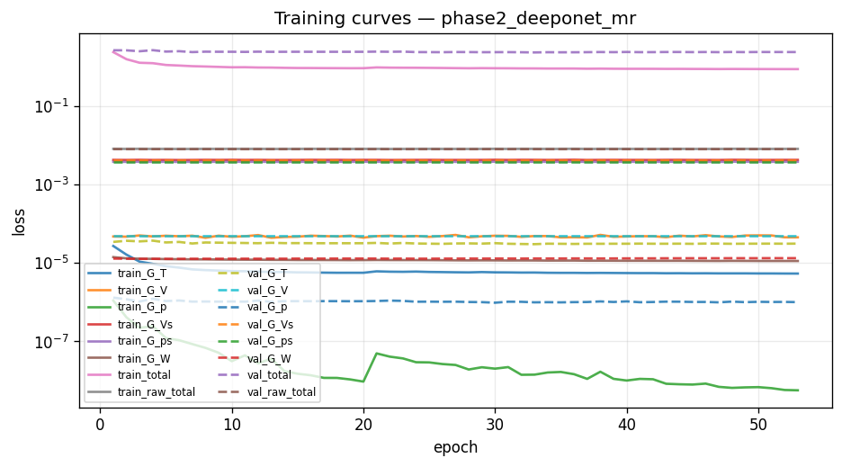
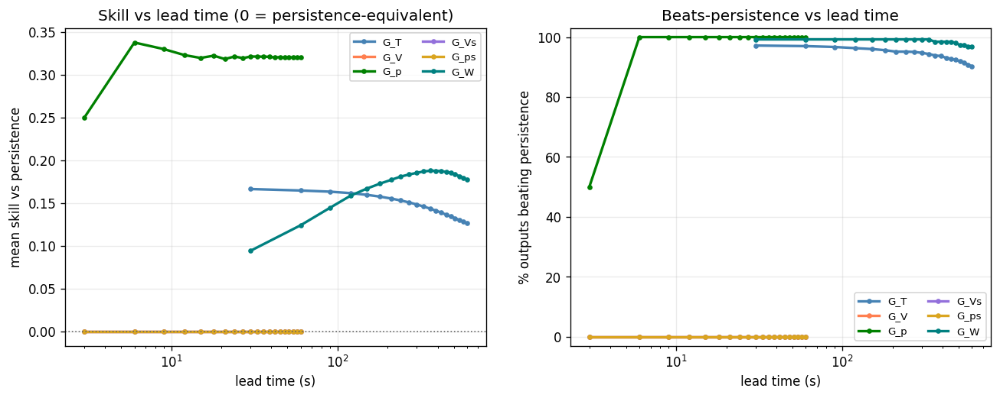
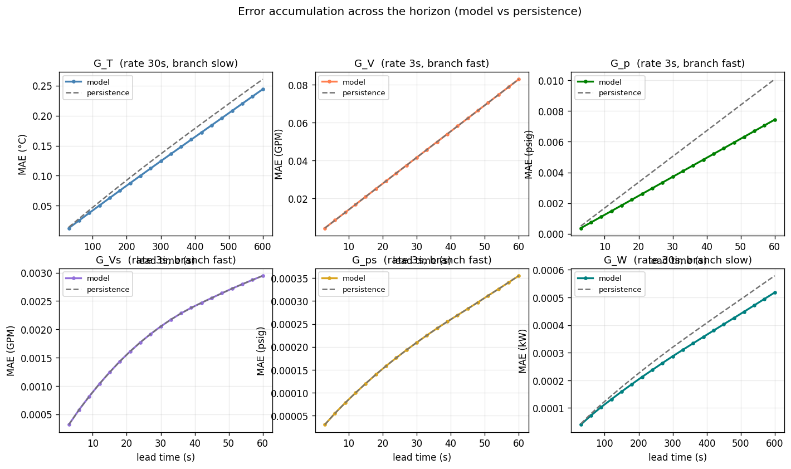
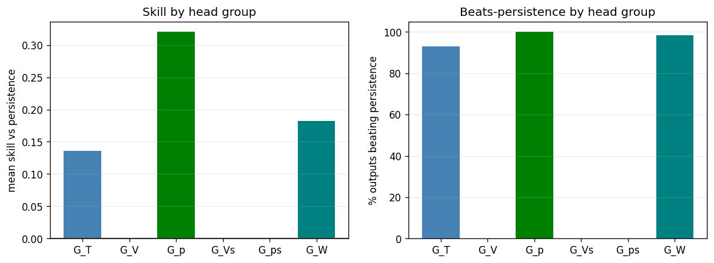

# Phase 2 (deeponet) — `phase2_deeponet_mr`

*Generated 2026-08-02 12:51:36 · MultiRateDeepONet · 55,594,626 parameters · 100.9 min*

## Run notes

Phase 2 basic DeepONet trained MULTI-RATE on the 720 h `systematic-720` data, on the identical task as run19b and the other phases (3 s hydraulics / 30 s thermal-power, seeded 80/10/10 chunk split (seed 42)).

Architecture: per-branch LSTM branch net -> basis coefficients; shared Fourier trunk over physical lead time -> basis; per-head plain operator (coeff x basis). This is the first phase with an operator basis and a trunk; comparing it to phase 1 isolates what those two components add.

Read by mean SKILL vs persistence, not mean R² (G_Vs is a measured channel noise floor for all phases).

## Headline

| metric | value |
| --- | --- |
| Outputs | 2827 |
| Mean R² | 0.9257 |
| Median R² | 0.9993 |
| Min R² | 0.0896 |
| Beats persistence | 60.9% |
| **Mean skill score** | **+0.1243** |

> Skill vs persistence is the headline metric, not mean R². Several channels sit at their noise floor, where R² is low for *any* predictor including persistence.

## Task (identical across phases 1-6 and run19b)

| group | rate (s) | history | K | window (s) | horizon (s) | branch |
| --- | --- | --- | --- | --- | --- | --- |
| G_T | 30 | 40 | 20 | 1200 | 600 | slow |
| G_V | 3 | 100 | 20 | 300 | 60 | fast |
| G_p | 3 | 100 | 20 | 300 | 60 | fast |
| G_Vs | 3 | 100 | 20 | 300 | 60 | fast |
| G_ps | 3 | 100 | 20 | 300 | 60 | fast |
| G_W | 30 | 40 | 20 | 1200 | 600 | slow |

| split | chunks | windows |
| --- | --- | --- |
| train | [0, 1, 2, 3, 4, 5, 7, 9, 10, 15, 16, 17, 18, 20, 21, 23, 24, 25, 26, 27, 28, 29, 30, 31, 32, 33, 34, 37, 38, 39, 40, 42, 43, 44, 45, 46, 48, 50, 51, 52, 55, 56, 57, 58, 59, 60, 61, 62, 63, 67, 68, 69, 70, 71, 72, 73, 74, 75, 76, 78, 79, 80, 81, 82, 83, 84, 85, 86, 87, 88, 89, 90, 91, 92, 93, 94, 95, 96, 98, 99, 100, 101, 103, 104, 105, 106, 108, 110, 111, 112, 115, 117, 118, 119, 120, 121, 122, 123, 124, 125, 126, 127] | 62,934 |
| val | [6, 11, 19, 22, 35, 41, 47, 49, 54, 64, 102, 114, 116] | 8,021 |
| test | [8, 12, 13, 14, 36, 53, 65, 66, 77, 97, 107, 109, 113] | 8,021 |

## Per head group

| group | outputs | horizon (s) | mean R² | median R² | beats | mean skill |
| --- | --- | --- | --- | --- | --- | --- |
| G_T | 1028 | 600 | 0.9975 | 0.9990 | 955/1028 (93%) | +0.1360 |
| G_V | 257 | 60 | 0.9997 | 0.9997 | 0/257 (0%) | +0.0000 |
| G_p | 514 | 60 | 1.0000 | 1.0000 | 514/514 (100%) | +0.3203 |
| G_Vs | 257 | 60 | 0.3059 | 0.3060 | 0/257 (0%) | +0.0000 |
| G_ps | 514 | 60 | 0.9440 | 0.9447 | 0/514 (0%) | +0.0000 |
| G_W | 257 | 600 | 0.9995 | 0.9995 | 253/257 (98%) | +0.1820 |

## Per output type

| Output_Type | R² mean | R² min | RMSE mean | MAE mean | Beats_Persistence mean |
| --- | --- | --- | --- | --- | --- |
| T_prim_r | 0.9982 | 0.9970 | 0.1837 | 0.1003 | 0.9144 |
| T_prim_s | 0.9927 | 0.9911 | 0.4170 | 0.2837 | 0.9844 |
| T_sec_r | 0.9993 | 0.9988 | 0.1051 | 0.0757 | 0.8327 |
| T_sec_s | 0.9996 | 0.9992 | 0.0830 | 0.0584 | 0.9844 |
| V_flow_prim | 0.9997 | 0.9995 | 0.1506 | 0.0436 | 0.0000 |
| V_flow_sec | 0.3059 | 0.0896 | 0.0045 | 0.0019 | 0.0000 |
| W_flow | 0.9995 | 0.9992 | 0.0004 | 0.0003 | 0.9844 |
| p_prim_r | 1.0000 | 1.0000 | 0.0085 | 0.0044 | 1.0000 |
| p_prim_s | 1.0000 | 1.0000 | 0.0055 | 0.0034 | 1.0000 |
| p_sec_r | 0.9440 | 0.9060 | 0.0005 | 0.0002 | 0.0000 |
| p_sec_s | 0.9440 | 0.9060 | 0.0005 | 0.0002 | 0.0000 |

## 20 worst outputs by R²

| Output | Group | R² | Skill_Score | RMSE |
| --- | --- | --- | --- | --- |
| simulator[1].datacenter[1].computeBlock[140].cdu[1].summary.V_flow_sec_GPM | G_Vs | 0.0896 | 0.0000 | 0.0058 |
| simulator[1].datacenter[1].computeBlock[81].cdu[1].summary.V_flow_sec_GPM | G_Vs | 0.1279 | 0.0000 | 0.0054 |
| simulator[1].datacenter[1].computeBlock[114].cdu[1].summary.V_flow_sec_GPM | G_Vs | 0.1805 | 0.0000 | 0.0054 |
| simulator[1].datacenter[1].computeBlock[120].cdu[1].summary.V_flow_sec_GPM | G_Vs | 0.1846 | 0.0000 | 0.0055 |
| simulator[1].datacenter[1].computeBlock[207].cdu[1].summary.V_flow_sec_GPM | G_Vs | 0.2073 | 0.0000 | 0.0050 |
| simulator[1].datacenter[1].computeBlock[98].cdu[1].summary.V_flow_sec_GPM | G_Vs | 0.2077 | 0.0000 | 0.0047 |
| simulator[1].datacenter[1].computeBlock[2].cdu[1].summary.V_flow_sec_GPM | G_Vs | 0.2127 | 0.0000 | 0.0049 |
| simulator[1].datacenter[1].computeBlock[238].cdu[1].summary.V_flow_sec_GPM | G_Vs | 0.2144 | 0.0000 | 0.0048 |
| simulator[1].datacenter[1].computeBlock[162].cdu[1].summary.V_flow_sec_GPM | G_Vs | 0.2153 | 0.0000 | 0.0044 |
| simulator[1].datacenter[1].computeBlock[54].cdu[1].summary.V_flow_sec_GPM | G_Vs | 0.2180 | 0.0000 | 0.0051 |
| simulator[1].datacenter[1].computeBlock[164].cdu[1].summary.V_flow_sec_GPM | G_Vs | 0.2233 | 0.0000 | 0.0049 |
| simulator[1].datacenter[1].computeBlock[223].cdu[1].summary.V_flow_sec_GPM | G_Vs | 0.2241 | 0.0000 | 0.0047 |
| simulator[1].datacenter[1].computeBlock[156].cdu[1].summary.V_flow_sec_GPM | G_Vs | 0.2257 | 0.0000 | 0.0046 |
| simulator[1].datacenter[1].computeBlock[75].cdu[1].summary.V_flow_sec_GPM | G_Vs | 0.2267 | 0.0000 | 0.0046 |
| simulator[1].datacenter[1].computeBlock[174].cdu[1].summary.V_flow_sec_GPM | G_Vs | 0.2270 | 0.0000 | 0.0049 |
| simulator[1].datacenter[1].computeBlock[161].cdu[1].summary.V_flow_sec_GPM | G_Vs | 0.2281 | 0.0000 | 0.0047 |
| simulator[1].datacenter[1].computeBlock[48].cdu[1].summary.V_flow_sec_GPM | G_Vs | 0.2316 | 0.0000 | 0.0051 |
| simulator[1].datacenter[1].computeBlock[1].cdu[1].summary.V_flow_sec_GPM | G_Vs | 0.2365 | 0.0000 | 0.0047 |
| simulator[1].datacenter[1].computeBlock[25].cdu[1].summary.V_flow_sec_GPM | G_Vs | 0.2372 | 0.0000 | 0.0044 |
| simulator[1].datacenter[1].computeBlock[101].cdu[1].summary.V_flow_sec_GPM | G_Vs | 0.2385 | 0.0000 | 0.0051 |

## Figures

### Training and validation loss per epoch.



### Skill and beats-persistence fraction versus lead time.



### Mean absolute error across the horizon, model versus persistence, per head.



### Per-head-group skill and beats-persistence.



## Full console log

```text
[ddp] rank 0/8 local_rank 0 device cuda:0  visible=8
==========================================================================
PHASE 2 — deeponet   [phase2_deeponet_mr]
==========================================================================
device: cuda:0
multi_rate: True   store rates (s): [3, 30]
group   rate(s)  history    K  window(s)  horizon(s)  branch
G_T          30       40   20       1200         600  slow
G_V           3      100   20        300          60  fast
G_p           3      100   20        300          60  fast
G_Vs          3      100   20        300          60  fast
G_ps          3      100   20        300          60  fast
G_W          30       40   20       1200         600  slow

============================================================
COLUMN IDENTIFICATION (Federated)
============================================================
Input columns:              515
Total dynamic outputs:      2827
  G_T  (temperatures):      1028
  G_V  (prim flow):         257
  G_p  (prim pressure):     514
  G_Vs (sec flow):          257
  G_ps (sec pressure):      514
  G_W  (pump power):        257
  Per-type index maps:      11 types

inputs: 515   dynamic outputs: 2827
[store] present, reusing: /lustre/orion/scratch/yishak_tadele/gen053/summit/data/systematic-720/store
[norm] loading shared normalizer: /lustre/orion/scratch/yishak_tadele/gen053/summit/data/systematic-720/store/normalizer_shared.json
FederatedNormalizer loaded from /lustre/orion/scratch/yishak_tadele/gen053/summit/data/systematic-720/store/normalizer_shared.json
loader workers: 6   batch: 32
Federated store [chunk split]: train=[0, 1, 2, 3, 4, 5, 7, 9, 10, 15, 16, 17, 18, 20, 21, 23, 24, 25, 26, 27, 28, 29, 30, 31, 32, 33, 34, 37, 38, 39, 40, 42, 43, 44, 45, 46, 48, 50, 51, 52, 55, 56, 57, 58, 59, 60, 61, 62, 63, 67, 68, 69, 70, 71, 72, 73, 74, 75, 76, 78, 79, 80, 81, 82, 83, 84, 85, 86, 87, 88, 89, 90, 91, 92, 93, 94, 95, 96, 98, 99, 100, 101, 103, 104, 105, 106, 108, 110, 111, 112, 115, 117, 118, 119, 120, 121, 122, 123, 124, 125, 126, 127] val=[6, 11, 19, 22, 35, 41, 47, 49, 54, 64, 102, 114, 116] test=[8, 12, 13, 14, 36, 53, 65, 66, 77, 97, 107, 109, 113] | multi_rate=True rates=[3, 30]
  windows: train=62934 val=8021 test=8021
[ddp] train sharded: 62934 windows / 8 ranks = ~7866 each; 245 steps/rank/epoch
DATA MANIFEST: {'train_chunks': [0, 1, 2, 3, 4, 5, 7, 9, 10, 15, 16, 17, 18, 20, 21, 23, 24, 25, 26, 27, 28, 29, 30, 31, 32, 33, 34, 37, 38, 39, 40, 42, 43, 44, 45, 46, 48, 50, 51, 52, 55, 56, 57, 58, 59, 60, 61, 62, 63, 67, 68, 69, 70, 71, 72, 73, 74, 75, 76, 78, 79, 80, 81, 82, 83, 84, 85, 86, 87, 88, 89, 90, 91, 92, 93, 94, 95, 96, 98, 99, 100, 101, 103, 104, 105, 106, 108, 110, 111, 112, 115, 117, 118, 119, 120, 121, 122, 123, 124, 125, 126, 127], 'val_chunks': [6, 11, 19, 22, 35, 41, 47, 49, 54, 64, 102, 114, 116], 'test_chunks': [8, 12, 13, 14, 36, 53, 65, 66, 77, 97, 107, 109, 113], 'windows': {'train': 62934, 'val': 8021, 'test': 8021}}

model: MultiRateDeepONet   parameters: 55,594,626

--------------------------------------------------------------------------
TRAINING
--------------------------------------------------------------------------
Distributed training: rank 0/8

======================================================================
PER-HEAD LOSS NORMALISATION (persistence baseline)
======================================================================
  head       baseline    cfg_w    effective
  G_T    3.384053e-05     1.00   2.9550e+04
  G_V    4.815543e-05     0.00   0.0000e+00
  G_p    1.583450e-06     1.00   6.3153e+05
  G_Vs   4.255081e-03     0.00   0.0000e+00
  G_ps   3.809307e-03     0.00   0.0000e+00
  G_W    1.562183e-05     1.00   6.4013e+04


======================================================================
TRAINING — Phase: DEEPONET
======================================================================

columns: ep | train/val total loss | best epoch | per-head val
         time line: wall (train/val) | throughput | steps | lr | peak GPU | v/t ratio | elapsed | ETA
ep   1/100  train 2.39887  val 2.67253  best@1  G_T=0.0000 G_V=0.0001 G_Vs=0.0042 G_W=0.0000 G_p=0.0000 G_ps=0.0037 raw_total=0.0080
        time  125.2s (tr  67.2 va  58.0)       934 samp/s   245 steps  lr 9.94e-04  gpu  1.25GiB  v/t  1.11  elapsed   2.1m  ETA   207m
  EarlyStopping: New best val_loss=2.672526
ep   2/100  train 1.58125  val 2.66100  best@2  G_T=0.0000 G_V=0.0001 G_Vs=0.0042 G_W=0.0000 G_p=0.0000 G_ps=0.0037 raw_total=0.0080
        time  111.9s (tr  57.4 va  54.4)     1,092 samp/s   245 steps  lr 9.76e-04  gpu  1.25GiB  v/t  1.68  elapsed   4.0m  ETA   183m
  EarlyStopping: New best val_loss=2.661004
ep   3/100  train 1.28310  val 2.52296  best@3  G_T=0.0000 G_V=0.0001 G_Vs=0.0042 G_W=0.0000 G_p=0.0000 G_ps=0.0037 raw_total=0.0080
        time  119.0s (tr  58.3 va  60.7)     1,076 samp/s   245 steps  lr 9.46e-04  gpu  1.25GiB  v/t  1.97  elapsed   5.9m  ETA   192m
  EarlyStopping: New best val_loss=2.522963
ep   4/100  train 1.25158  val 2.68695  best@3  G_T=0.0000 G_V=0.0001 G_Vs=0.0042 G_W=0.0000 G_p=0.0000 G_ps=0.0037 raw_total=0.0080
        time  113.3s (tr  58.2 va  55.1)     1,078 samp/s   245 steps  lr 9.05e-04  gpu  1.25GiB  v/t  2.15  elapsed   7.8m  ETA   181m
  EarlyStopping: No improvement for 1/20 epochs
ep   5/100  train 1.12642  val 2.47564  best@5  G_T=0.0000 G_V=0.0001 G_Vs=0.0042 G_W=0.0000 G_p=0.0000 G_ps=0.0037 raw_total=0.0080
        time  112.9s (tr  57.9 va  55.0)     1,084 samp/s   245 steps  lr 8.54e-04  gpu  1.25GiB  v/t  2.20  elapsed   9.7m  ETA   179m
  EarlyStopping: New best val_loss=2.475637
ep   6/100  train 1.08978  val 2.52947  best@5  G_T=0.0000 G_V=0.0001 G_Vs=0.0042 G_W=0.0000 G_p=0.0000 G_ps=0.0037 raw_total=0.0080
        time  113.2s (tr  58.3 va  54.9)     1,076 samp/s   245 steps  lr 7.94e-04  gpu  1.25GiB  v/t  2.32  elapsed  11.6m  ETA   177m
  EarlyStopping: No improvement for 1/20 epochs
ep   7/100  train 1.04975  val 2.40167  best@7  G_T=0.0000 G_V=0.0001 G_Vs=0.0042 G_W=0.0000 G_p=0.0000 G_ps=0.0037 raw_total=0.0080
        time  112.7s (tr  58.1 va  54.6)     1,080 samp/s   245 steps  lr 7.27e-04  gpu  1.25GiB  v/t  2.29  elapsed  13.5m  ETA   175m
  EarlyStopping: New best val_loss=2.401670
ep   8/100  train 1.02919  val 2.46231  best@7  G_T=0.0000 G_V=0.0001 G_Vs=0.0042 G_W=0.0000 G_p=0.0000 G_ps=0.0037 raw_total=0.0080
        time  113.7s (tr  58.5 va  55.2)     1,071 samp/s   245 steps  lr 6.55e-04  gpu  1.25GiB  v/t  2.39  elapsed  15.4m  ETA   174m
  EarlyStopping: No improvement for 1/20 epochs
ep   9/100  train 1.00622  val 2.44798  best@7  G_T=0.0000 G_V=0.0001 G_Vs=0.0042 G_W=0.0000 G_p=0.0000 G_ps=0.0037 raw_total=0.0080
        time  112.9s (tr  57.9 va  55.1)     1,084 samp/s   245 steps  lr 5.78e-04  gpu  1.25GiB  v/t  2.43  elapsed  17.3m  ETA   171m
  EarlyStopping: No improvement for 2/20 epochs
ep  10/100  train 0.98353  val 2.44679  best@7  G_T=0.0000 G_V=0.0001 G_Vs=0.0042 G_W=0.0000 G_p=0.0000 G_ps=0.0037 raw_total=0.0080
        time  113.9s (tr  58.5 va  55.4)     1,073 samp/s   245 steps  lr 5.00e-04  gpu  1.25GiB  v/t  2.49  elapsed  19.2m  ETA   171m
  EarlyStopping: No improvement for 3/20 epochs
ep  11/100  train 0.98738  val 2.42973  best@7  G_T=0.0000 G_V=0.0001 G_Vs=0.0042 G_W=0.0000 G_p=0.0000 G_ps=0.0037 raw_total=0.0080
        time  113.1s (tr  57.9 va  55.2)     1,084 samp/s   245 steps  lr 4.22e-04  gpu  1.25GiB  v/t  2.46  elapsed  21.0m  ETA   168m
  EarlyStopping: No improvement for 4/20 epochs
ep  12/100  train 0.97080  val 2.46192  best@7  G_T=0.0000 G_V=0.0001 G_Vs=0.0042 G_W=0.0000 G_p=0.0000 G_ps=0.0037 raw_total=0.0080
        time  113.1s (tr  57.9 va  55.2)     1,083 samp/s   245 steps  lr 3.45e-04  gpu  1.25GiB  v/t  2.54  elapsed  22.9m  ETA   166m
  EarlyStopping: No improvement for 5/20 epochs
ep  13/100  train 0.96669  val 2.43926  best@7  G_T=0.0000 G_V=0.0001 G_Vs=0.0042 G_W=0.0000 G_p=0.0000 G_ps=0.0037 raw_total=0.0080
        time  113.4s (tr  58.0 va  55.4)     1,082 samp/s   245 steps  lr 2.73e-04  gpu  1.25GiB  v/t  2.52  elapsed  24.8m  ETA   164m
  EarlyStopping: No improvement for 6/20 epochs
ep  14/100  train 0.95277  val 2.44330  best@7  G_T=0.0000 G_V=0.0001 G_Vs=0.0042 G_W=0.0000 G_p=0.0000 G_ps=0.0037 raw_total=0.0080
        time  113.0s (tr  57.8 va  55.2)     1,085 samp/s   245 steps  lr 2.06e-04  gpu  1.25GiB  v/t  2.56  elapsed  26.7m  ETA   162m
  EarlyStopping: No improvement for 7/20 epochs
ep  15/100  train 0.94316  val 2.44943  best@7  G_T=0.0000 G_V=0.0001 G_Vs=0.0042 G_W=0.0000 G_p=0.0000 G_ps=0.0037 raw_total=0.0080
        time  113.4s (tr  58.2 va  55.3)     1,079 samp/s   245 steps  lr 1.46e-04  gpu  1.25GiB  v/t  2.60  elapsed  28.6m  ETA   161m
  EarlyStopping: No improvement for 8/20 epochs
ep  16/100  train 0.94136  val 2.44343  best@7  G_T=0.0000 G_V=0.0001 G_Vs=0.0042 G_W=0.0000 G_p=0.0000 G_ps=0.0037 raw_total=0.0080
        time  113.0s (tr  58.1 va  54.9)     1,080 samp/s   245 steps  lr 9.55e-05  gpu  1.25GiB  v/t  2.60  elapsed  30.5m  ETA   158m
  EarlyStopping: No improvement for 9/20 epochs
ep  17/100  train 0.93700  val 2.44431  best@7  G_T=0.0000 G_V=0.0001 G_Vs=0.0042 G_W=0.0000 G_p=0.0000 G_ps=0.0037 raw_total=0.0080
        time  114.0s (tr  58.9 va  55.1)     1,065 samp/s   245 steps  lr 5.45e-05  gpu  1.25GiB  v/t  2.61  elapsed  32.4m  ETA   158m
  EarlyStopping: No improvement for 10/20 epochs
ep  18/100  train 0.93398  val 2.44401  best@7  G_T=0.0000 G_V=0.0001 G_Vs=0.0042 G_W=0.0000 G_p=0.0000 G_ps=0.0037 raw_total=0.0080
        time  113.1s (tr  58.2 va  54.8)     1,077 samp/s   245 steps  lr 2.45e-05  gpu  1.25GiB  v/t  2.62  elapsed  34.3m  ETA   155m
  EarlyStopping: No improvement for 11/20 epochs
ep  19/100  train 0.93090  val 2.44143  best@7  G_T=0.0000 G_V=0.0001 G_Vs=0.0042 G_W=0.0000 G_p=0.0000 G_ps=0.0037 raw_total=0.0080
        time  113.5s (tr  58.3 va  55.2)     1,076 samp/s   245 steps  lr 6.16e-06  gpu  1.25GiB  v/t  2.62  elapsed  36.1m  ETA   153m
  EarlyStopping: No improvement for 12/20 epochs
ep  20/100  train 0.93232  val 2.44426  best@7  G_T=0.0000 G_V=0.0001 G_Vs=0.0042 G_W=0.0000 G_p=0.0000 G_ps=0.0037 raw_total=0.0080
        time  113.5s (tr  58.1 va  55.3)     1,079 samp/s   245 steps  lr 1.00e-03  gpu  1.25GiB  v/t  2.62  elapsed  38.0m  ETA   151m
  EarlyStopping: No improvement for 13/20 epochs
ep  21/100  train 0.97601  val 2.46804  best@7  G_T=0.0000 G_V=0.0001 G_Vs=0.0042 G_W=0.0000 G_p=0.0000 G_ps=0.0037 raw_total=0.0080
        time  113.5s (tr  57.9 va  55.6)     1,083 samp/s   245 steps  lr 9.98e-04  gpu  1.25GiB  v/t  2.53  elapsed  39.9m  ETA   150m
  EarlyStopping: No improvement for 14/20 epochs
ep  22/100  train 0.96366  val 2.44578  best@7  G_T=0.0000 G_V=0.0001 G_Vs=0.0042 G_W=0.0000 G_p=0.0000 G_ps=0.0037 raw_total=0.0080
        time  113.1s (tr  58.1 va  55.0)     1,080 samp/s   245 steps  lr 9.94e-04  gpu  1.25GiB  v/t  2.54  elapsed  41.8m  ETA   147m
  EarlyStopping: No improvement for 15/20 epochs
ep  23/100  train 0.95892  val 2.46880  best@7  G_T=0.0000 G_V=0.0001 G_Vs=0.0042 G_W=0.0000 G_p=0.0000 G_ps=0.0037 raw_total=0.0080
        time  113.7s (tr  58.3 va  55.5)     1,077 samp/s   245 steps  lr 9.86e-04  gpu  1.25GiB  v/t  2.57  elapsed  43.7m  ETA   146m
  EarlyStopping: No improvement for 16/20 epochs
ep  24/100  train 0.95669  val 2.40228  best@7  G_T=0.0000 G_V=0.0001 G_Vs=0.0042 G_W=0.0000 G_p=0.0000 G_ps=0.0037 raw_total=0.0080
        time  113.0s (tr  57.9 va  55.0)     1,083 samp/s   245 steps  lr 9.76e-04  gpu  1.25GiB  v/t  2.51  elapsed  45.6m  ETA   143m
  EarlyStopping: No improvement for 17/20 epochs
ep  25/100  train 0.95083  val 2.39523  best@25  G_T=0.0000 G_V=0.0001 G_Vs=0.0042 G_W=0.0000 G_p=0.0000 G_ps=0.0037 raw_total=0.0080
        time  113.2s (tr  58.3 va  54.9)     1,077 samp/s   245 steps  lr 9.62e-04  gpu  1.25GiB  v/t  2.52  elapsed  47.5m  ETA   142m
  EarlyStopping: New best val_loss=2.395233
ep  26/100  train 0.94402  val 2.38595  best@26  G_T=0.0000 G_V=0.0001 G_Vs=0.0042 G_W=0.0000 G_p=0.0000 G_ps=0.0037 raw_total=0.0080
        time  113.1s (tr  58.3 va  54.8)     1,075 samp/s   245 steps  lr 9.46e-04  gpu  1.25GiB  v/t  2.53  elapsed  49.4m  ETA   140m
  EarlyStopping: New best val_loss=2.385954
ep  27/100  train 0.93636  val 2.41006  best@26  G_T=0.0000 G_V=0.0001 G_Vs=0.0042 G_W=0.0000 G_p=0.0000 G_ps=0.0037 raw_total=0.0080
        time  113.2s (tr  58.2 va  55.0)     1,077 samp/s   245 steps  lr 9.26e-04  gpu  1.25GiB  v/t  2.57  elapsed  51.3m  ETA   138m
  EarlyStopping: No improvement for 1/20 epochs
ep  28/100  train 0.92866  val 2.40397  best@26  G_T=0.0000 G_V=0.0001 G_Vs=0.0042 G_W=0.0000 G_p=0.0000 G_ps=0.0037 raw_total=0.0080
        time  113.9s (tr  58.3 va  55.5)     1,075 samp/s   245 steps  lr 9.05e-04  gpu  1.25GiB  v/t  2.59  elapsed  53.2m  ETA   137m
  EarlyStopping: No improvement for 2/20 epochs
ep  29/100  train 0.93525  val 2.38497  best@29  G_T=0.0000 G_V=0.0001 G_Vs=0.0042 G_W=0.0000 G_p=0.0000 G_ps=0.0037 raw_total=0.0080
        time  113.3s (tr  58.1 va  55.2)     1,079 samp/s   245 steps  lr 8.80e-04  gpu  1.25GiB  v/t  2.55  elapsed  55.0m  ETA   134m
  EarlyStopping: New best val_loss=2.384971
ep  30/100  train 0.93013  val 2.39176  best@29  G_T=0.0000 G_V=0.0001 G_Vs=0.0042 G_W=0.0000 G_p=0.0000 G_ps=0.0037 raw_total=0.0080
        time  112.7s (tr  58.0 va  54.8)     1,082 samp/s   245 steps  lr 8.54e-04  gpu  1.25GiB  v/t  2.57  elapsed  56.9m  ETA   132m
  EarlyStopping: No improvement for 1/20 epochs
ep  31/100  train 0.92713  val 2.39520  best@29  G_T=0.0000 G_V=0.0001 G_Vs=0.0042 G_W=0.0000 G_p=0.0000 G_ps=0.0037 raw_total=0.0080
        time  113.6s (tr  58.5 va  55.1)     1,073 samp/s   245 steps  lr 8.25e-04  gpu  1.25GiB  v/t  2.58  elapsed  58.8m  ETA   131m
  EarlyStopping: No improvement for 2/20 epochs
ep  32/100  train 0.92111  val 2.37813  best@32  G_T=0.0000 G_V=0.0001 G_Vs=0.0042 G_W=0.0000 G_p=0.0000 G_ps=0.0037 raw_total=0.0080
        time  113.5s (tr  58.1 va  55.4)     1,079 samp/s   245 steps  lr 7.94e-04  gpu  1.25GiB  v/t  2.58  elapsed  60.7m  ETA   129m
  EarlyStopping: New best val_loss=2.378131
ep  33/100  train 0.92002  val 2.35418  best@33  G_T=0.0000 G_V=0.0001 G_Vs=0.0042 G_W=0.0000 G_p=0.0000 G_ps=0.0037 raw_total=0.0080
        time  113.7s (tr  58.3 va  55.4)     1,075 samp/s   245 steps  lr 7.61e-04  gpu  1.25GiB  v/t  2.56  elapsed  62.6m  ETA   127m
  EarlyStopping: New best val_loss=2.354179
ep  34/100  train 0.91423  val 2.38352  best@33  G_T=0.0000 G_V=0.0001 G_Vs=0.0042 G_W=0.0000 G_p=0.0000 G_ps=0.0037 raw_total=0.0080
        time  112.6s (tr  57.9 va  54.7)     1,082 samp/s   245 steps  lr 7.27e-04  gpu  1.25GiB  v/t  2.61  elapsed  64.5m  ETA   124m
  EarlyStopping: No improvement for 1/20 epochs
ep  35/100  train 0.91431  val 2.37215  best@33  G_T=0.0000 G_V=0.0001 G_Vs=0.0042 G_W=0.0000 G_p=0.0000 G_ps=0.0037 raw_total=0.0080
        time  113.3s (tr  58.4 va  54.8)     1,073 samp/s   245 steps  lr 6.91e-04  gpu  1.25GiB  v/t  2.59  elapsed  66.4m  ETA   123m
  EarlyStopping: No improvement for 2/20 epochs
ep  36/100  train 0.91365  val 2.37650  best@33  G_T=0.0000 G_V=0.0001 G_Vs=0.0042 G_W=0.0000 G_p=0.0000 G_ps=0.0037 raw_total=0.0080
        time  113.5s (tr  58.4 va  55.1)     1,074 samp/s   245 steps  lr 6.55e-04  gpu  1.25GiB  v/t  2.60  elapsed  68.3m  ETA   121m
  EarlyStopping: No improvement for 3/20 epochs
ep  37/100  train 0.90372  val 2.38992  best@33  G_T=0.0000 G_V=0.0001 G_Vs=0.0042 G_W=0.0000 G_p=0.0000 G_ps=0.0037 raw_total=0.0080
        time  113.1s (tr  58.4 va  54.6)     1,073 samp/s   245 steps  lr 6.17e-04  gpu  1.25GiB  v/t  2.64  elapsed  70.2m  ETA   119m
  EarlyStopping: No improvement for 4/20 epochs
ep  38/100  train 0.90873  val 2.40869  best@33  G_T=0.0000 G_V=0.0001 G_Vs=0.0042 G_W=0.0000 G_p=0.0000 G_ps=0.0037 raw_total=0.0080
        time  113.4s (tr  58.5 va  54.9)     1,073 samp/s   245 steps  lr 5.78e-04  gpu  1.25GiB  v/t  2.65  elapsed  72.0m  ETA   117m
  EarlyStopping: No improvement for 5/20 epochs
ep  39/100  train 0.90288  val 2.39219  best@33  G_T=0.0000 G_V=0.0001 G_Vs=0.0042 G_W=0.0000 G_p=0.0000 G_ps=0.0037 raw_total=0.0080
        time  113.7s (tr  58.5 va  55.2)     1,072 samp/s   245 steps  lr 5.39e-04  gpu  1.25GiB  v/t  2.65  elapsed  73.9m  ETA   116m
  EarlyStopping: No improvement for 6/20 epochs
ep  40/100  train 0.89981  val 2.41755  best@33  G_T=0.0000 G_V=0.0001 G_Vs=0.0042 G_W=0.0000 G_p=0.0000 G_ps=0.0037 raw_total=0.0080
        time  113.3s (tr  58.1 va  55.2)     1,080 samp/s   245 steps  lr 5.00e-04  gpu  1.25GiB  v/t  2.69  elapsed  75.8m  ETA   113m
  EarlyStopping: No improvement for 7/20 epochs
ep  41/100  train 0.90017  val 2.39099  best@33  G_T=0.0000 G_V=0.0001 G_Vs=0.0042 G_W=0.0000 G_p=0.0000 G_ps=0.0037 raw_total=0.0080
        time  113.5s (tr  58.3 va  55.1)     1,075 samp/s   245 steps  lr 4.61e-04  gpu  1.25GiB  v/t  2.66  elapsed  77.7m  ETA   112m
  EarlyStopping: No improvement for 8/20 epochs
ep  42/100  train 0.89877  val 2.39554  best@33  G_T=0.0000 G_V=0.0001 G_Vs=0.0042 G_W=0.0000 G_p=0.0000 G_ps=0.0037 raw_total=0.0080
        time  113.3s (tr  58.4 va  54.9)     1,074 samp/s   245 steps  lr 4.22e-04  gpu  1.25GiB  v/t  2.67  elapsed  79.6m  ETA   110m
  EarlyStopping: No improvement for 9/20 epochs
ep  43/100  train 0.89510  val 2.41255  best@33  G_T=0.0000 G_V=0.0001 G_Vs=0.0042 G_W=0.0000 G_p=0.0000 G_ps=0.0037 raw_total=0.0080
        time  113.7s (tr  58.6 va  55.1)     1,070 samp/s   245 steps  lr 3.83e-04  gpu  1.25GiB  v/t  2.70  elapsed  81.5m  ETA   108m
  EarlyStopping: No improvement for 10/20 epochs
ep  44/100  train 0.89600  val 2.41387  best@33  G_T=0.0000 G_V=0.0001 G_Vs=0.0042 G_W=0.0000 G_p=0.0000 G_ps=0.0037 raw_total=0.0080
        time  113.5s (tr  58.2 va  55.4)     1,078 samp/s   245 steps  lr 3.45e-04  gpu  1.25GiB  v/t  2.69  elapsed  83.4m  ETA   106m
  EarlyStopping: No improvement for 11/20 epochs
ep  45/100  train 0.89226  val 2.39830  best@33  G_T=0.0000 G_V=0.0001 G_Vs=0.0042 G_W=0.0000 G_p=0.0000 G_ps=0.0037 raw_total=0.0080
        time  113.4s (tr  58.1 va  55.2)     1,079 samp/s   245 steps  lr 3.09e-04  gpu  1.25GiB  v/t  2.69  elapsed  85.3m  ETA   104m
  EarlyStopping: No improvement for 12/20 epochs
ep  46/100  train 0.89036  val 2.41099  best@33  G_T=0.0000 G_V=0.0001 G_Vs=0.0042 G_W=0.0000 G_p=0.0000 G_ps=0.0037 raw_total=0.0080
        time  117.7s (tr  62.6 va  55.2)     1,003 samp/s   245 steps  lr 2.73e-04  gpu  1.25GiB  v/t  2.71  elapsed  87.2m  ETA   106m
  EarlyStopping: No improvement for 13/20 epochs
ep  47/100  train 0.88666  val 2.39225  best@33  G_T=0.0000 G_V=0.0001 G_Vs=0.0042 G_W=0.0000 G_p=0.0000 G_ps=0.0037 raw_total=0.0080
        time  119.2s (tr  58.4 va  60.8)     1,074 samp/s   245 steps  lr 2.39e-04  gpu  1.25GiB  v/t  2.70  elapsed  89.2m  ETA   105m
  EarlyStopping: No improvement for 14/20 epochs
ep  48/100  train 0.89048  val 2.41545  best@33  G_T=0.0000 G_V=0.0001 G_Vs=0.0042 G_W=0.0000 G_p=0.0000 G_ps=0.0037 raw_total=0.0080
        time  112.8s (tr  58.2 va  54.6)     1,078 samp/s   245 steps  lr 2.06e-04  gpu  1.25GiB  v/t  2.71  elapsed  91.1m  ETA    98m
  EarlyStopping: No improvement for 15/20 epochs
ep  49/100  train 0.88866  val 2.39832  best@33  G_T=0.0000 G_V=0.0001 G_Vs=0.0042 G_W=0.0000 G_p=0.0000 G_ps=0.0037 raw_total=0.0080
        time  113.8s (tr  58.3 va  55.5)     1,075 samp/s   245 steps  lr 1.75e-04  gpu  1.25GiB  v/t  2.70  elapsed  93.0m  ETA    97m
  EarlyStopping: No improvement for 16/20 epochs
ep  50/100  train 0.88590  val 2.41350  best@33  G_T=0.0000 G_V=0.0001 G_Vs=0.0042 G_W=0.0000 G_p=0.0000 G_ps=0.0037 raw_total=0.0080
        time  112.7s (tr  57.9 va  54.8)     1,083 samp/s   245 steps  lr 1.46e-04  gpu  1.25GiB  v/t  2.72  elapsed  94.9m  ETA    94m
  EarlyStopping: No improvement for 17/20 epochs
ep  51/100  train 0.88462  val 2.41127  best@33  G_T=0.0000 G_V=0.0001 G_Vs=0.0042 G_W=0.0000 G_p=0.0000 G_ps=0.0037 raw_total=0.0080
        time  113.7s (tr  58.6 va  55.1)     1,070 samp/s   245 steps  lr 1.20e-04  gpu  1.25GiB  v/t  2.73  elapsed  96.8m  ETA    93m
  EarlyStopping: No improvement for 18/20 epochs
ep  52/100  train 0.88356  val 2.40823  best@33  G_T=0.0000 G_V=0.0001 G_Vs=0.0042 G_W=0.0000 G_p=0.0000 G_ps=0.0037 raw_total=0.0080
        time  113.4s (tr  57.8 va  55.6)     1,085 samp/s   245 steps  lr 9.55e-05  gpu  1.25GiB  v/t  2.73  elapsed  98.7m  ETA    91m
  EarlyStopping: No improvement for 19/20 epochs
ep  53/100  train 0.88256  val 2.40613  best@33  G_T=0.0000 G_V=0.0001 G_Vs=0.0042 G_W=0.0000 G_p=0.0000 G_ps=0.0037 raw_total=0.0080
        time  112.7s (tr  57.8 va  54.9)     1,086 samp/s   245 steps  lr 7.37e-05  gpu  1.25GiB  v/t  2.73  elapsed 100.5m  ETA    88m
  EarlyStopping: No improvement for 20/20 epochs

Early stopping at epoch 53
  EarlyStopping: Restored best weights from epoch 32

Training complete.
  Epochs trained:       53
  Best validation loss: 2.354179
  Training time:        6032.9s (100.5 min)

training done in 100.9 min   best val 2.354179 @ epoch 33
FederatedNormalizer saved to runs/phase2_deeponet_mr/normalizer.json

--------------------------------------------------------------------------
EVALUATION (test split)
--------------------------------------------------------------------------
======================================================================
RESULTS SUMMARY — phase2_deeponet_mr
======================================================================

--- All 2827 Outputs ---
  Mean/Median R²:    0.9257 / 0.9993
  Min R²:            0.0896
  Beats Persistence: 1722/2827 (60.9%)
  Mean Skill Score:  +0.1243

--- Per Decoder Head Group ---

  G_T (1028 outputs, horizon 600s):
    Mean/Median R²: 0.9975 / 0.9990   Beats: 955/1028 (92.9%)   Skill: +0.1360   R²-margin: +3.25e-04

  G_V (257 outputs, horizon 60s):
    Mean/Median R²: 0.9997 / 0.9997   Beats: 0/257 (0.0%)   Skill: +0.0000   R²-margin: +0.00e+00

  G_p (514 outputs, horizon 60s):
    Mean/Median R²: 1.0000 / 1.0000   Beats: 514/514 (100.0%)   Skill: +0.3203   R²-margin: +6.07e-06

  G_Vs (257 outputs, horizon 60s):
    Mean/Median R²: 0.3059 / 0.3060   Beats: 0/257 (0.0%)   Skill: +0.0000   R²-margin: +0.00e+00

  G_ps (514 outputs, horizon 60s):
    Mean/Median R²: 0.9440 / 0.9447   Beats: 0/514 (0.0%)   Skill: +0.0000   R²-margin: +0.00e+00

  G_W (257 outputs, horizon 600s):
    Mean/Median R²: 0.9995 / 0.9995   Beats: 253/257 (98.4%)   Skill: +0.1820   R²-margin: +1.08e-04

--- Per Output Type ---
                 R²            RMSE     MAE Beats_Persistence Variance_Ratio
               mean     min    mean    mean              mean           mean
Output_Type                                                                 
T_prim_r     0.9982  0.9970  0.1837  0.1003            0.9144         1.0126
T_prim_s     0.9927  0.9911  0.4170  0.2837            0.9844         0.9965
T_sec_r      0.9993  0.9988  0.1051  0.0757            0.8327         1.0004
T_sec_s      0.9996  0.9992  0.0830  0.0584            0.9844         1.0004
V_flow_prim  0.9997  0.9995  0.1506  0.0436            0.0000         1.0029
V_flow_sec   0.3059  0.0896  0.0045  0.0019            0.0000         0.9997
W_flow       0.9995  0.9992  0.0004  0.0003            0.9844         1.0003
p_prim_r     1.0000  1.0000  0.0085  0.0044            1.0000         0.9992
p_prim_s     1.0000  1.0000  0.0055  0.0034            1.0000         0.9999
p_sec_r      0.9440  0.9060  0.0005  0.0002            0.0000         1.0015
p_sec_s      0.9440  0.9060  0.0005  0.0002            0.0000         1.0015
```

## Artifacts

- `config.json`
- `data_manifest.json`
- `error_accum.png`
- `group_summary.png`
- `history.json`
- `metrics.csv`
- `model.pt`
- `normalizer.json`
- `notes.txt`
- `per_step.npy`
- `phase_summary.json`
- `report.md`
- `run_log.txt`
- `skill_vs_lead.png`
- `training_curves.png`
