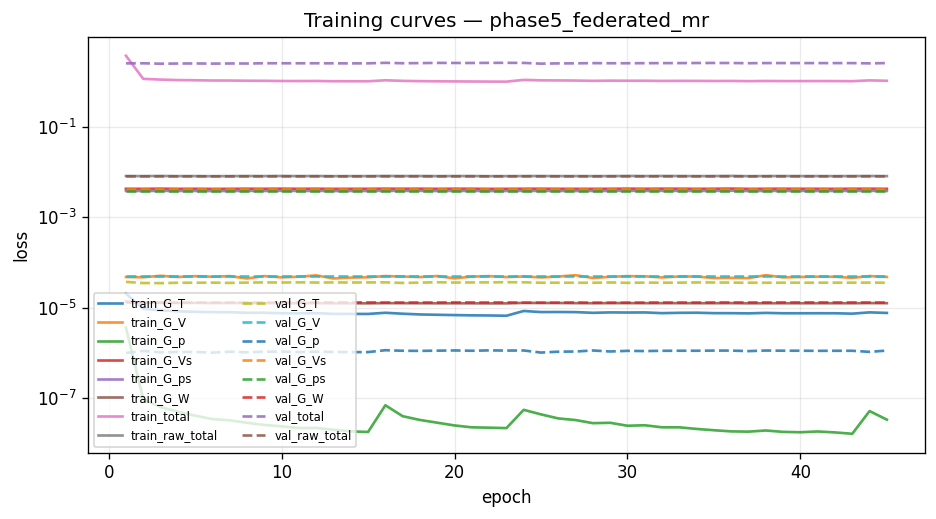
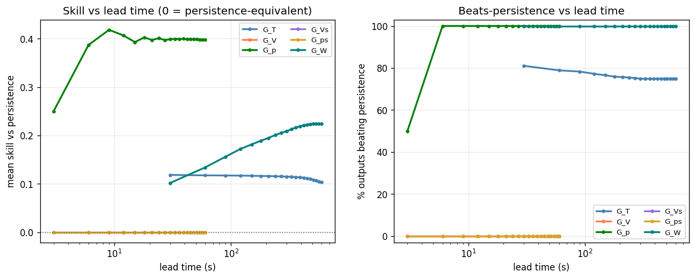
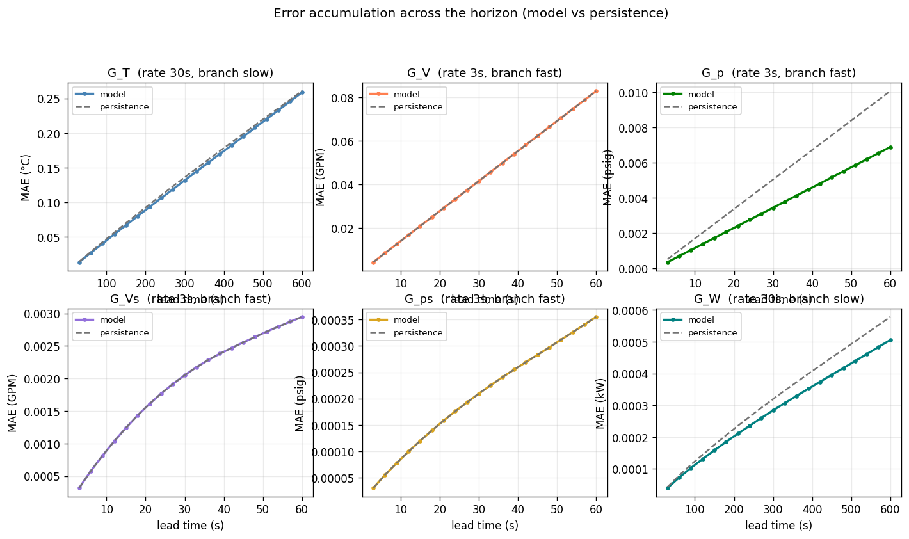
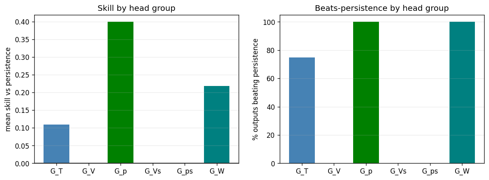

# Phase 5 (federated) — `phase5_federated_mr`

*Generated 2026-08-02 16:38:02 · FederatedDeepMMNet · 5,868,638 parameters · 87.1 min*

## Run notes

Phase 5 federated DeepMMNet trained MULTI-RATE on the 720 h `systematic-720` data, identical task to run19b and the other phases.

Architecture: per-branch u/y LSTM encoders + one shared Fourier trunk + per-group decoder heads (standard/skip per head_types). This is the in-library ancestor of the MR-MIONet run series: run19b = this backbone PLUS a future-forcing branch, attention fusion, one learnable GatedDeltaHead per group, beta-NLL, and per-head best checkpointing. Phase 5's gap to run19b is exactly the value of those additions.

Two-phase training: round-robin per-head warmup (phase1_epochs) then joint fine-tuning with differential LRs (phase2_epochs).

Read by mean SKILL vs persistence, not mean R².

## Headline

| metric | value |
| --- | --- |
| Outputs | 2827 |
| Mean R² | 0.9256 |
| Median R² | 0.9994 |
| Min R² | 0.0896 |
| Beats persistence | 54.5% |
| **Mean skill score** | **+0.1320** |

> Skill vs persistence is the headline metric, not mean R². Several channels sit at their noise floor, where R² is low for *any* predictor including persistence.

## Task (identical across phases 1-6 and run19b)

| group | rate (s) | history | K | window (s) | horizon (s) | branch |
| --- | --- | --- | --- | --- | --- | --- |
| G_T | 30 | 40 | 20 | 1200 | 600 | slow |
| G_V | 3 | 100 | 20 | 300 | 60 | fast |
| G_p | 3 | 100 | 20 | 300 | 60 | fast |
| G_Vs | 3 | 100 | 20 | 300 | 60 | fast |
| G_ps | 3 | 100 | 20 | 300 | 60 | fast |
| G_W | 30 | 40 | 20 | 1200 | 600 | slow |

| split | chunks | windows |
| --- | --- | --- |
| train | [0, 1, 2, 3, 4, 5, 7, 9, 10, 15, 16, 17, 18, 20, 21, 23, 24, 25, 26, 27, 28, 29, 30, 31, 32, 33, 34, 37, 38, 39, 40, 42, 43, 44, 45, 46, 48, 50, 51, 52, 55, 56, 57, 58, 59, 60, 61, 62, 63, 67, 68, 69, 70, 71, 72, 73, 74, 75, 76, 78, 79, 80, 81, 82, 83, 84, 85, 86, 87, 88, 89, 90, 91, 92, 93, 94, 95, 96, 98, 99, 100, 101, 103, 104, 105, 106, 108, 110, 111, 112, 115, 117, 118, 119, 120, 121, 122, 123, 124, 125, 126, 127] | 62,934 |
| val | [6, 11, 19, 22, 35, 41, 47, 49, 54, 64, 102, 114, 116] | 8,021 |
| test | [8, 12, 13, 14, 36, 53, 65, 66, 77, 97, 107, 109, 113] | 8,021 |

## Per head group

| group | outputs | horizon (s) | mean R² | median R² | beats | mean skill |
| --- | --- | --- | --- | --- | --- | --- |
| G_T | 1028 | 600 | 0.9971 | 0.9989 | 770/1028 (75%) | +0.1090 |
| G_V | 257 | 60 | 0.9997 | 0.9997 | 0/257 (0%) | +0.0000 |
| G_p | 514 | 60 | 1.0000 | 1.0000 | 514/514 (100%) | +0.3992 |
| G_Vs | 257 | 60 | 0.3059 | 0.3060 | 0/257 (0%) | +0.0000 |
| G_ps | 514 | 60 | 0.9440 | 0.9447 | 0/514 (0%) | +0.0000 |
| G_W | 257 | 600 | 0.9996 | 0.9996 | 257/257 (100%) | +0.2181 |

## Per output type

| Output_Type | R² mean | R² min | RMSE mean | MAE mean | Beats_Persistence mean |
| --- | --- | --- | --- | --- | --- |
| T_prim_r | 0.9982 | 0.9973 | 0.1838 | 0.1070 | 1.0000 |
| T_prim_s | 0.9911 | 0.9887 | 0.4609 | 0.3110 | 0.0000 |
| T_sec_r | 0.9994 | 0.9990 | 0.1008 | 0.0729 | 0.9961 |
| T_sec_s | 0.9996 | 0.9993 | 0.0824 | 0.0583 | 1.0000 |
| V_flow_prim | 0.9997 | 0.9995 | 0.1506 | 0.0436 | 0.0000 |
| V_flow_sec | 0.3059 | 0.0896 | 0.0045 | 0.0019 | 0.0000 |
| W_flow | 0.9996 | 0.9992 | 0.0004 | 0.0003 | 1.0000 |
| p_prim_r | 1.0000 | 1.0000 | 0.0082 | 0.0041 | 1.0000 |
| p_prim_s | 1.0000 | 1.0000 | 0.0051 | 0.0031 | 1.0000 |
| p_sec_r | 0.9440 | 0.9060 | 0.0005 | 0.0002 | 0.0000 |
| p_sec_s | 0.9440 | 0.9060 | 0.0005 | 0.0002 | 0.0000 |

## 20 worst outputs by R²

| Output | Group | R² | Skill_Score | RMSE |
| --- | --- | --- | --- | --- |
| simulator[1].datacenter[1].computeBlock[140].cdu[1].summary.V_flow_sec_GPM | G_Vs | 0.0896 | 0.0000 | 0.0058 |
| simulator[1].datacenter[1].computeBlock[81].cdu[1].summary.V_flow_sec_GPM | G_Vs | 0.1279 | 0.0000 | 0.0054 |
| simulator[1].datacenter[1].computeBlock[114].cdu[1].summary.V_flow_sec_GPM | G_Vs | 0.1805 | 0.0000 | 0.0054 |
| simulator[1].datacenter[1].computeBlock[120].cdu[1].summary.V_flow_sec_GPM | G_Vs | 0.1846 | 0.0000 | 0.0055 |
| simulator[1].datacenter[1].computeBlock[207].cdu[1].summary.V_flow_sec_GPM | G_Vs | 0.2073 | 0.0000 | 0.0050 |
| simulator[1].datacenter[1].computeBlock[98].cdu[1].summary.V_flow_sec_GPM | G_Vs | 0.2077 | 0.0000 | 0.0047 |
| simulator[1].datacenter[1].computeBlock[2].cdu[1].summary.V_flow_sec_GPM | G_Vs | 0.2127 | 0.0000 | 0.0049 |
| simulator[1].datacenter[1].computeBlock[238].cdu[1].summary.V_flow_sec_GPM | G_Vs | 0.2144 | 0.0000 | 0.0048 |
| simulator[1].datacenter[1].computeBlock[162].cdu[1].summary.V_flow_sec_GPM | G_Vs | 0.2153 | 0.0000 | 0.0044 |
| simulator[1].datacenter[1].computeBlock[54].cdu[1].summary.V_flow_sec_GPM | G_Vs | 0.2180 | 0.0000 | 0.0051 |
| simulator[1].datacenter[1].computeBlock[164].cdu[1].summary.V_flow_sec_GPM | G_Vs | 0.2233 | 0.0000 | 0.0049 |
| simulator[1].datacenter[1].computeBlock[223].cdu[1].summary.V_flow_sec_GPM | G_Vs | 0.2241 | 0.0000 | 0.0047 |
| simulator[1].datacenter[1].computeBlock[156].cdu[1].summary.V_flow_sec_GPM | G_Vs | 0.2257 | 0.0000 | 0.0046 |
| simulator[1].datacenter[1].computeBlock[75].cdu[1].summary.V_flow_sec_GPM | G_Vs | 0.2267 | 0.0000 | 0.0046 |
| simulator[1].datacenter[1].computeBlock[174].cdu[1].summary.V_flow_sec_GPM | G_Vs | 0.2270 | 0.0000 | 0.0049 |
| simulator[1].datacenter[1].computeBlock[161].cdu[1].summary.V_flow_sec_GPM | G_Vs | 0.2281 | 0.0000 | 0.0047 |
| simulator[1].datacenter[1].computeBlock[48].cdu[1].summary.V_flow_sec_GPM | G_Vs | 0.2316 | 0.0000 | 0.0051 |
| simulator[1].datacenter[1].computeBlock[1].cdu[1].summary.V_flow_sec_GPM | G_Vs | 0.2365 | 0.0000 | 0.0047 |
| simulator[1].datacenter[1].computeBlock[25].cdu[1].summary.V_flow_sec_GPM | G_Vs | 0.2372 | 0.0000 | 0.0044 |
| simulator[1].datacenter[1].computeBlock[101].cdu[1].summary.V_flow_sec_GPM | G_Vs | 0.2385 | 0.0000 | 0.0051 |

## Figures

### Training and validation loss per epoch.



### Skill and beats-persistence fraction versus lead time.



### Mean absolute error across the horizon, model versus persistence, per head.



### Per-head-group skill and beats-persistence.



## Full console log

```text
[ddp] rank 0/8 local_rank 0 device cuda:0  visible=8
==========================================================================
PHASE 5 — federated   [phase5_federated_mr]
==========================================================================
device: cuda:0
multi_rate: True   store rates (s): [3, 30]
group   rate(s)  history    K  window(s)  horizon(s)  branch
G_T          30       40   20       1200         600  slow
G_V           3      100   20        300          60  fast
G_p           3      100   20        300          60  fast
G_Vs          3      100   20        300          60  fast
G_ps          3      100   20        300          60  fast
G_W          30       40   20       1200         600  slow

============================================================
COLUMN IDENTIFICATION (Federated)
============================================================
Input columns:              515
Total dynamic outputs:      2827
  G_T  (temperatures):      1028
  G_V  (prim flow):         257
  G_p  (prim pressure):     514
  G_Vs (sec flow):          257
  G_ps (sec pressure):      514
  G_W  (pump power):        257
  Per-type index maps:      11 types

inputs: 515   dynamic outputs: 2827
[store] present, reusing: /lustre/orion/scratch/yishak_tadele/gen053/summit/data/systematic-720/store
[norm] loading shared normalizer: /lustre/orion/scratch/yishak_tadele/gen053/summit/data/systematic-720/store/normalizer_shared.json
FederatedNormalizer loaded from /lustre/orion/scratch/yishak_tadele/gen053/summit/data/systematic-720/store/normalizer_shared.json
loader workers: 6   batch: 32
Federated store [chunk split]: train=[0, 1, 2, 3, 4, 5, 7, 9, 10, 15, 16, 17, 18, 20, 21, 23, 24, 25, 26, 27, 28, 29, 30, 31, 32, 33, 34, 37, 38, 39, 40, 42, 43, 44, 45, 46, 48, 50, 51, 52, 55, 56, 57, 58, 59, 60, 61, 62, 63, 67, 68, 69, 70, 71, 72, 73, 74, 75, 76, 78, 79, 80, 81, 82, 83, 84, 85, 86, 87, 88, 89, 90, 91, 92, 93, 94, 95, 96, 98, 99, 100, 101, 103, 104, 105, 106, 108, 110, 111, 112, 115, 117, 118, 119, 120, 121, 122, 123, 124, 125, 126, 127] val=[6, 11, 19, 22, 35, 41, 47, 49, 54, 64, 102, 114, 116] test=[8, 12, 13, 14, 36, 53, 65, 66, 77, 97, 107, 109, 113] | multi_rate=True rates=[3, 30]
  windows: train=62934 val=8021 test=8021
[ddp] train sharded: 62934 windows / 8 ranks = ~7866 each; 245 steps/rank/epoch
DATA MANIFEST: {'train_chunks': [0, 1, 2, 3, 4, 5, 7, 9, 10, 15, 16, 17, 18, 20, 21, 23, 24, 25, 26, 27, 28, 29, 30, 31, 32, 33, 34, 37, 38, 39, 40, 42, 43, 44, 45, 46, 48, 50, 51, 52, 55, 56, 57, 58, 59, 60, 61, 62, 63, 67, 68, 69, 70, 71, 72, 73, 74, 75, 76, 78, 79, 80, 81, 82, 83, 84, 85, 86, 87, 88, 89, 90, 91, 92, 93, 94, 95, 96, 98, 99, 100, 101, 103, 104, 105, 106, 108, 110, 111, 112, 115, 117, 118, 119, 120, 121, 122, 123, 124, 125, 126, 127], 'val_chunks': [6, 11, 19, 22, 35, 41, 47, 49, 54, 64, 102, 114, 116], 'test_chunks': [8, 12, 13, 14, 36, 53, 65, 66, 77, 97, 107, 109, 113], 'windows': {'train': 62934, 'val': 8021, 'test': 8021}}

model: FederatedDeepMMNet   parameters: 5,868,638

--------------------------------------------------------------------------
TRAINING
--------------------------------------------------------------------------
Distributed training: rank 0/8

======================================================================
PER-HEAD LOSS NORMALISATION (persistence baseline)
======================================================================
  head       baseline    cfg_w    effective
  G_T    3.384053e-05     1.00   2.9550e+04
  G_V    4.815543e-05     0.00   0.0000e+00
  G_p    1.583450e-06     1.00   6.3153e+05
  G_Vs   4.255081e-03     0.00   0.0000e+00
  G_ps   3.809307e-03     0.00   0.0000e+00
  G_W    1.562183e-05     1.00   6.4013e+04


======================================================================
TRAINING — Phase 5: Federated DeepMMNet
======================================================================

======================================================================
PHASE 1: Round-Robin Training (6 Decoder Heads)
======================================================================

Phase 1 early stopping at epoch 23
Phase 1 best validation loss: 2.498271

======================================================================
PHASE 2: Joint Fine-Tuning (6 Heads)
  Encoder LR: 0.001
  Head LR:    0.0001
======================================================================

Phase 2 early stopping at epoch 22
Phase 2 best validation loss: 2.506243
Phase 2 (2.506243) worse than Phase 1 (2.498271) — restored Phase 1 weights.

Total training time: 5200.1s

training done in 87.1 min   best val 2.498271 @ epoch 3
FederatedNormalizer saved to runs/phase5_federated_mr/normalizer.json

--------------------------------------------------------------------------
EVALUATION (test split)
--------------------------------------------------------------------------
======================================================================
RESULTS SUMMARY — phase5_federated_mr
======================================================================

--- All 2827 Outputs ---
  Mean/Median R²:    0.9256 / 0.9994
  Min R²:            0.0896
  Beats Persistence: 1541/2827 (54.5%)
  Mean Skill Score:  +0.1320

--- Per Decoder Head Group ---

  G_T (1028 outputs, horizon 600s):
    Mean/Median R²: 0.9971 / 0.9989   Beats: 770/1028 (74.9%)   Skill: +0.1090   R²-margin: -5.97e-05

  G_V (257 outputs, horizon 60s):
    Mean/Median R²: 0.9997 / 0.9997   Beats: 0/257 (0.0%)   Skill: +0.0000   R²-margin: +0.00e+00

  G_p (514 outputs, horizon 60s):
    Mean/Median R²: 1.0000 / 1.0000   Beats: 514/514 (100.0%)   Skill: +0.3992   R²-margin: +7.64e-06

  G_Vs (257 outputs, horizon 60s):
    Mean/Median R²: 0.3059 / 0.3060   Beats: 0/257 (0.0%)   Skill: +0.0000   R²-margin: +0.00e+00

  G_ps (514 outputs, horizon 60s):
    Mean/Median R²: 0.9440 / 0.9447   Beats: 0/514 (0.0%)   Skill: +0.0000   R²-margin: +0.00e+00

  G_W (257 outputs, horizon 600s):
    Mean/Median R²: 0.9996 / 0.9996   Beats: 257/257 (100.0%)   Skill: +0.2181   R²-margin: +1.28e-04

--- Per Output Type ---
                 R²            RMSE     MAE Beats_Persistence Variance_Ratio
               mean     min    mean    mean              mean           mean
Output_Type                                                                 
T_prim_r     0.9982  0.9973  0.1838  0.1070            1.0000         1.0112
T_prim_s     0.9911  0.9887  0.4609  0.3110            0.0000         1.0146
T_sec_r      0.9994  0.9990  0.1008  0.0729            0.9961         1.0022
T_sec_s      0.9996  0.9993  0.0824  0.0583            1.0000         1.0022
V_flow_prim  0.9997  0.9995  0.1506  0.0436            0.0000         1.0029
V_flow_sec   0.3059  0.0896  0.0045  0.0019            0.0000         0.9997
W_flow       0.9996  0.9992  0.0004  0.0003            1.0000         1.0020
p_prim_r     1.0000  1.0000  0.0082  0.0041            1.0000         0.9994
p_prim_s     1.0000  1.0000  0.0051  0.0031            1.0000         1.0006
p_sec_r      0.9440  0.9060  0.0005  0.0002            0.0000         1.0015
p_sec_s      0.9440  0.9060  0.0005  0.0002            0.0000         1.0015
```

## Artifacts

- `config.json`
- `data_manifest.json`
- `error_accum.png`
- `group_summary.png`
- `history.json`
- `metrics.csv`
- `model.pt`
- `normalizer.json`
- `notes.txt`
- `per_step.npy`
- `phase_summary.json`
- `report.md`
- `run_log.txt`
- `skill_vs_lead.png`
- `training_curves.png`
